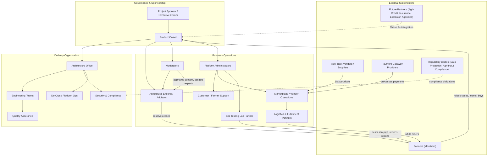
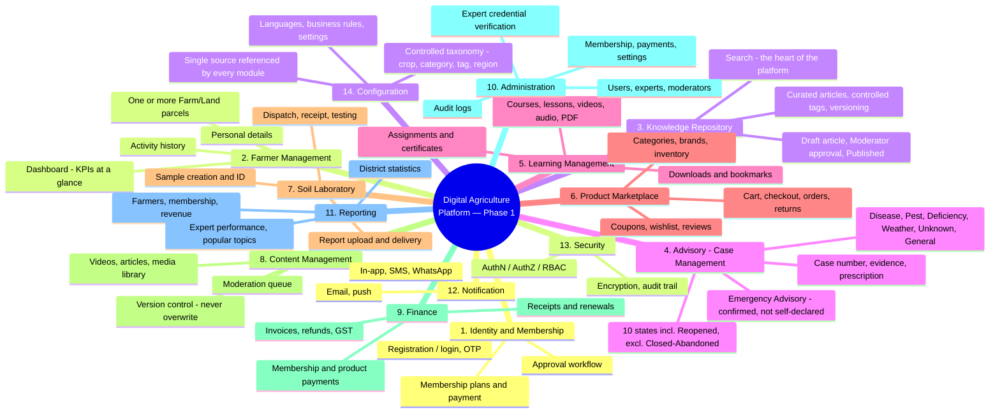
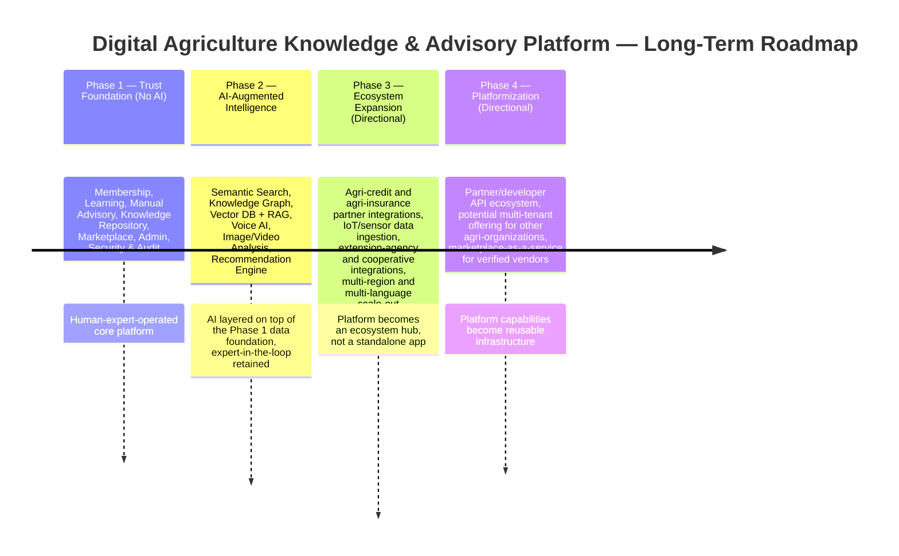

# 000 — Project Charter

**Document Type:** Foundational Governance Document
**Document Owner:** Product & Architecture Office
**Status:** Approved
**Version:** 1.0.0
**Classification:** Internal — Strategic Planning
**Applies To:** Digital Agriculture Knowledge & Advisory Platform ("the Platform"), all phases

---

## Document Control

| Field | Value |
|---|---|
| Document ID | AGRI-CHTR-000 |
| Document Name | Project Charter |
| Version | 1.0.0 |
| Status | Approved |
| Author | Principal Architecture Office (multi-discipline: Solution, Product, Business, Security, Database, DevOps, UX) |
| Reviewers | Project Sponsor / Product Owner (approved 2026-08-06) |
| Approval Authority | Project Sponsor / Executive Owner |
| Next Review Date | Upon Phase 1 scope freeze, or upon material scope change |
| Related Documents | `01-Product/01-Vision.md` (next in series) |

### Revision History

| Version | Date | Author | Description |
|---|---|---|---|
| 0.1.0 | Initial draft | Architecture Office | First draft of Project Charter, created prior to any downstream design work |
| 0.2.0 | Sponsor domain review | Architecture Office | Incorporated sponsor's domain refinement: "Case Management" replaces "Question/Advisory" terminology throughout; adopted the 14-module structure; added the Moderator role; added dashboard-first UX, full LMS/ecommerce/Soil Laboratory scope, and the seven farmer-utility additions (Downloads, Bookmarks, Recently Viewed, Feedback, Emergency Advisory, Version Control, Media Library) to Sections 7–10 and the Glossary |
| 0.3.0 | Architecture Office review | Architecture Office | Incorporated architecture review findings: added a sixth Case category (General Advisory / Planning Question) so non-problem queries aren't mismodeled; added a **Reopened** Case state and a farmer-dispute path off Answered; separated the **Knowledge Article Publication Workflow** (Draft Article → Moderator Approval → Published) from the Case Lifecycle itself; gave Module 14 (Configuration) explicit ownership of a controlled taxonomy; added a Feedback-driven Moderator review trigger; added an Emergency Advisory anti-abuse confirmation step; added the Soil Testing Lab Partner stakeholder; named India/DPDP Act 2023 explicitly in Assumptions and Constraints; noted a read-model/aggregation approach for the Farmer Dashboard |
| 0.4.0 | Architecture Office review | Architecture Office | Introduced **Farm/Land Parcel** as its own domain entity under Farmer (a farmer may operate more than one), so Cases and Soil Reports link to the specific parcel they concern rather than to the farmer generally; gave Module 10 (Administration) explicit scope for verifying expert credentials (qualification, license, certification) before Expert Portal activation, grounding Risk R9's mitigation in real scope |
| 1.0.0 | 2026-08-06 | Project Sponsor / Product Owner | Reviewed and approved. Charter is now binding — all downstream documents in this series must trace back to the scope, principles, and terminology fixed here. |

---

## 1. Executive Summary

The **Digital Agriculture Knowledge & Advisory Platform** ("the Platform") is a purpose-built, enterprise-grade digital system that connects farmers with agricultural knowledge, expert advisory services, learning content, and agri-input marketplaces through a single, trusted, membership-based digital experience.

Smallholder and mid-scale farmers in emerging agricultural economies today face a structural information gap: agronomic knowledge exists, but it is fragmented across word-of-mouth, informal social media groups, unlicensed input dealers, and inconsistent extension services. When a farmer encounters a problem — a pest outbreak, an unexplained yield drop, a soil health question — there is no reliable, accountable, auditable channel to reach a qualified expert, describe the problem with evidence (photos, videos, soil data), and receive a documented, trackable resolution.

This Platform is architected to close that gap by digitizing the entire farmer-to-expert advisory lifecycle: membership and identity, structured learning content, an evidence-based **Case Management** system modeled on CRM ticketing practice — a farmer doesn't only "ask a question," they report a Disease, Pest, Nutrient Deficiency, Weather Damage, an Unknown Problem, or raise a General Advisory / Planning question — a curated knowledge repository that every closed case can feed (after a Moderator publishes it), an integrated marketplace for agricultural inputs, and administrative and moderation tooling for the experts and staff who operate the system.

**Phase 1 is deliberately and explicitly non-AI.** Every case a farmer raises is resolved by a human agricultural expert through the structured, auditable Case Lifecycle. This is a foundational business decision, not a technical limitation: the platform must first prove that a *trusted, human-verified* advisory loop creates real value and real trust before any automation is introduced into that trust relationship. However, every subsystem — case intake, knowledge storage, media handling, search, notifications — is architected under **Enterprise First**, **API First**, and **Future AI Ready** principles so that Phase 2 (AI-assisted search, semantic knowledge graph, RAG-based advisory support, voice and image analysis, recommendations) can be layered on without re-architecting the foundation.

This document is the first in a structured, enterprise documentation series. It exists to align all subsequent product, architecture, security, and engineering decisions to a single, board-level, unambiguous statement of *what this platform is, who it is for, why it exists, what it will and will not do in Phase 1, and how success will be measured.* No design, database, API, or engineering document in this series should be produced until the scope and principles defined here are approved.

---

## 2. Vision

> **To become the trusted digital front door between every farmer and the agricultural knowledge, expertise, and inputs they need to farm profitably, sustainably, and with confidence.**

The long-term vision extends beyond a single advisory tool. The Platform is envisioned as the foundational knowledge and trust layer of a broader digital agriculture ecosystem — one where:

- Every farmer, regardless of literacy level, language, or connectivity, can access verified agricultural knowledge in a format they can consume (video, audio, simplified text, visual).
- Every case a farmer raises generates a permanent, structured, reusable Knowledge Article — so the 1,000th farmer to report the same pest problem benefits from the answer given to the 1st.
- Every case, transaction, and interaction is captured with enough structure and metadata that, in a later phase, machine learning and AI systems can be trained on the platform's own verified, expert-approved data — not scraped or unverified third-party data.
- The platform becomes commercially self-sustaining through an integrated marketplace, without ever compromising the objectivity of expert advisory (a documented conflict-of-interest boundary, see [Section 15](#15-guiding-principles)).

This vision is intentionally staged. Phase 1 delivers the trust and data foundation. Phase 2 (out of scope for this document, but architecturally anticipated) delivers intelligence on top of that foundation.

---

## 3. Mission

> **In Phase 1, we will deliver a manually operated, expert-staffed digital advisory and learning platform that is reliable, auditable, and easy enough for a low-digital-literacy farmer to use — while capturing every interaction in a structured form that makes the platform progressively smarter without ever making the farmer wait for a machine to be ready.**

The mission statement translates the vision into an operating mandate for the immediate build:

1. **Serve the farmer first.** Every design decision is evaluated against: "Can a farmer with a basic smartphone, inconsistent connectivity, and limited digital literacy complete this task?"
2. **Make experts productive, not overwhelmed.** The Case Management workflow must let a finite pool of agricultural experts serve a growing farmer base without linear headcount growth — through structured intake, a searchable knowledge base of prior answers, and case triage.
3. **Build the data foundation for tomorrow, using the workflows of today.** Every farmer case, expert answer, uploaded photo, and soil report is stored in a normalized, structured, and — where applicable — tagged/labeled form from day one, even though no AI consumes it yet.
4. **Never let commerce compromise advice.** The marketplace and Case Management are functionally and organizationally separated so that product recommendations are never presented as, or influenced by, sales incentives.

---

## 4. Project Objectives

| # | Objective | Type | Phase |
|---|---|---|---|
| O1 | Launch a membership-based platform where farmers can register, verify their identity/mobile number, and manage a profile | Functional | 1 |
| O2 | Provide Learning Management — courses, lessons, videos, audio, PDFs, assignments, and certificates — organized by crop and topic | Functional | 1 |
| O3 | Enable farmers to report a **Case** (Disease, Pest, Nutrient Deficiency, Weather Damage, Unknown Problem, or a General Advisory/Planning question) with photo, video, voice, and text evidence | Functional | 1 |
| O4 | Enable qualified experts to triage, work, and resolve farmer Cases through a defined Case Lifecycle — including farmer-initiated reopening and expert follow-up — with SLAs at each stage | Functional | 1 |
| O5 | Build a browsable, searchable Knowledge Repository, populated from Moderator-approved Knowledge Articles (drafted from Closed cases) and from curated content | Functional | 1 |
| O6 | Provide a full agricultural-input Marketplace (categories, brands, inventory, orders, returns, coupons, wishlist, reviews) with online payment | Functional | 1 |
| O7 | Enable farmers to submit soil samples for laboratory testing and track them end to end (collection → dispatch → testing → report) as structured input to their case history | Functional | 1 |
| O8 | Provide administrative and moderation tooling for expert management, content approval, case oversight, and marketplace operations | Functional | 1 |
| O9 | Provide notifications (in-app/SMS/push/WhatsApp/email) for case updates, order status, and platform announcements | Functional | 1 |
| O10 | Establish a security, audit, and data-privacy foundation appropriate for handling farmer PII, payment data, and land/crop data | Non-Functional | 1 |
| O11 | Establish reporting and business intelligence for platform operators (membership, revenue, case volume, expert performance, popular topics, district statistics) | Functional | 1 |
| O12 | Architect all Phase 1 subsystems so that AI-based search, recommendation, and advisory-assist can be introduced in Phase 2 without redesigning data models or APIs | Non-Functional | 1 (design constraint), realized in 2 |
| O13 | Establish version-controlled, audit-friendly, production-ready documentation for every subsystem before implementation begins | Process | 1 |
| O14 | Capture farmer-facing engagement signals — downloads, bookmarks, recently viewed, and helpful/not-helpful feedback with ratings — on every article, case resolution, and course, routing consistently low-rated content into the Moderator review queue, as both a farmer utility/operational quality loop and a Future AI Ready training signal | Functional | 1 |

---

## 5. Business Goals

Business goals differ from project objectives in that they describe *organizational outcomes*, not platform features. They are the measures a sponsor or investor would ask about.

1. **Farmer Trust & Retention** — Establish the platform as a farmer's default first channel for agricultural problems, measured by repeat usage (cases per farmer per season) and retention across crop cycles.
2. **Expert Capacity Leverage** — Increase the number of farmers a single agricultural expert can effectively serve, using the knowledge repository and case-deflection (farmers finding answers without needing to file a new case) as leverage.
3. **Marketplace Revenue** — Generate sustainable transaction revenue through the agri-input marketplace, positioned as a complementary — not primary — value stream to case management.
4. **Data Moat** — Accumulate a proprietary, structured, expert-verified corpus of farmer cases, case evidence (photos/soil data), and expert answers that has standalone strategic value for Phase 2 AI and for partnerships (input companies, agri-insurance, agri-credit).
5. **Operational Efficiency** — Reduce the administrative and coordination overhead of running an advisory service compared to today's informal (phone call, WhatsApp group, field visit) channels.
6. **Brand & Reputation** — Build a reputation for *accountable* agricultural advice — every answer traceable to a named expert, every case auditable — differentiating the platform from anonymous social-media agricultural advice.

---

## 6. Success Criteria

Success criteria are the specific, testable conditions under which Phase 1 is considered a validated success. These are illustrative targets to be finalized with the business sponsor; they are included here so architecture and process design have a concrete bar to design against.

| Category | Success Criterion | Illustrative Target |
|---|---|---|
| Adoption | Registered farmer members within first operating season | To be set by sponsor |
| Engagement | Average cases filed per active farmer per season | ≥ 1 |
| Case Resolution Quality | Case resolution rate (Closed via Farmer Confirmed, excluding Closed-Abandoned) | ≥ 90% |
| Case Resolution Quality | Reopened rate (cases the farmer disputes instead of confirming) | ≤ 5% |
| Case Response Speed | Median time from Submitted to first expert response (Expert Working) | ≤ 24 hours |
| Case Response Speed | Median time from Submitted to Closed | ≤ 5 days |
| Knowledge Reuse | % of new cases where the expert reuses/links an existing Knowledge Article instead of writing from scratch | Tracked, target set post-baseline |
| Marketplace | Order fulfillment success rate | ≥ 98% |
| Marketplace | Payment failure/dispute rate | ≤ 1% |
| Platform Reliability | Platform uptime (core services: login, case submission, marketplace checkout) | ≥ 99.5% |
| Security | Zero critical/high severity security incidents involving farmer PII or payment data | 0 |
| Data Readiness | % of cases and knowledge articles stored with complete structured metadata (crop, issue category, region, resolution) required for future AI ingestion | 100% (structural requirement, enforced by design) |
| Operational | Expert-to-farmer ratio sustainable at target case volume without SLA breach | Defined during Phase 1 capacity planning |

A dedicated **Success Metrics & Analytics** document will formalize measurement instrumentation later in the documentation series (see `01-Product/07-Success-Metrics.md` in the repository structure).

---

## 7. Stakeholders

### 7.1 Stakeholder Map

### 7.2 Stakeholder Register

| Stakeholder | Role | Primary Interest | Influence | Engagement Approach |
|---|---|---|---|---|
| Project Sponsor / Executive Owner | Funds and ultimately owns platform outcomes | ROI, business goals, brand risk | High | Approves charter, phase gates, budget |
| Product Owner | Owns roadmap and prioritization | Feature-market fit, user satisfaction | High | Owns backlog, approves each documentation deliverable |
| Architecture Office | Designs the system end-to-end | Technical soundness, extensibility, security | High | Authors this document series |
| Agricultural Experts / Advisors | Work assigned cases, author knowledge content | Manageable workload, good tooling, professional credit | High (operational) | Consulted on Case Management workflow, Expert Portal UX |
| Moderators | Approve articles/videos, assign experts to cases, merge duplicate knowledge articles, review cases, manage categories and tags | Clean, non-duplicated knowledge base; efficient review queue | Medium-High | Consulted on moderation queue and Knowledge Repository governance |
| Platform Administrators | Operate day-to-day platform (users, experts, membership, payments, knowledge, courses, products, orders, reports, audit logs, settings) | Efficient admin tooling, visibility/reporting | Medium-High | Consulted on admin & reporting requirements |
| Farmers (Members) | End users of learning, advisory, and marketplace | Trustworthy answers, ease of use, fair pricing | High (the reason the platform exists) | Represented via UX research, usability testing, target-user personas |
| Agri-Input Vendors / Suppliers | Supply marketplace products | Sales visibility, fair marketplace rules | Medium | Consulted on marketplace/vendor onboarding requirements |
| Logistics & Fulfillment Partners | Deliver marketplace orders | Clear order/fulfillment data, SLAs | Medium | Integrated via Order/Fulfillment APIs |
| Soil Testing Lab Partner | External lab that tests dispatched soil samples and returns reports | Clear sample-tracking data, realistic turnaround SLAs | Medium | Integrated via the Soil Laboratory module's dispatch/receipt/report APIs; turnaround time affects farmer trust the same way case-resolution time does |
| Payment Gateway Providers | Process online payments | Compliant integration, reconciliation | Medium | Integrated per PCI-aligned payment architecture |
| Security & Compliance Function | Protects farmer and business data | Regulatory compliance, breach prevention | High (gatekeeping) | Reviews and approves Security Architecture document |
| DevOps / Platform Operations | Runs infrastructure, ensures uptime | Operability, observability, cost | Medium-High | Owns DevOps & Deployment documents |
| Regulatory Bodies | External data protection / agri-input trade regulation | Legal compliance | High (non-negotiable constraint) | Constraints captured in Security & Compliance documentation |
| Future Partners (agri-credit, insurance, extension agencies) | Potential Phase 2+ ecosystem integrations | API access to verified farmer/case data (with consent) | Low (Phase 1), rising later | Not engaged in Phase 1; anticipated in long-term roadmap |

---

## 8. Target Users

The Platform serves distinct user personas, each with materially different needs, digital literacy, and access patterns. Precise, detailed personas (with journeys, devices, literacy assumptions, and language needs) will be developed in `01-Product/05-Target-Users.md`; this section defines the primary categories that all downstream scope decisions must account for.

| Persona | Description | Primary Goals | Key Constraints to Design For |
|---|---|---|---|
| **Farmer (Member)** | Smallholder to mid-scale farmer, primary platform consumer, may operate more than one Farm/Land parcel | Learn, report problems as Cases against a specific Farm/Land, get trusted answers, buy inputs, track soil health and case history per parcel from a single dashboard | Variable digital literacy, regional language needs, inconsistent connectivity/low-bandwidth, primarily mobile (Android-first), may rely on voice/photo over text |
| **Agricultural Expert / Advisor** | Domain expert (agronomist, extension officer, crop specialist) employed or contracted by the platform operator, credentials verified by Administration before activation | Work an assigned case queue efficiently, reuse prior knowledge, build a body of authored content, see own performance | Needs an efficient Expert Portal (assigned/pending/in-progress/answered/closed views), search over prior cases, structured intake (not free-text chaos), desktop/tablet-first |
| **Moderator** | Content and case-quality gatekeeper, distinct from Administrator | Approve articles and videos before publication, assign experts to unassigned cases, merge duplicate knowledge articles, review case quality, manage categories/tags | Needs a moderation queue UI separate from both the Expert Portal and the Administrator console |
| **Platform Administrator** | Internal operations staff running the business, not case quality | Manage users, experts, membership, payments, knowledge, courses, products, orders, reports, and audit logs | Needs dashboards, bulk operations, audit trails |
| **Vendor / Supplier (Marketplace)** | Business entity supplying agri-inputs listed in the marketplace | List products, manage inventory/pricing, fulfill orders | Needs a vendor portal or admin-mediated onboarding (scope decision for Phase 1, see Assumptions) |
| **Support Agent** | Handles account, payment, and order issues not related to agronomic case management | Resolve non-case-management tickets quickly | Needs visibility into member, order, and payment status without agronomic case access necessarily |
| **Guest / Prospective Member** | Unregistered visitor evaluating the platform | Browse public knowledge/success stories, decide to register | Needs a public, no-login browsing surface (see wireframe reference: success stories, video previews) |

---

## 9. High Level Features

The Phase 1 product surface is organized into **fourteen modules**. This numbering is canonical — it is the module numbering every subsequent document in this series (Product, Requirements, Architecture, Database, API) must reuse, per the Domain-Driven Design principle in [Section 15](#15-guiding-principles). Each module will be elaborated into full functional requirements in the `03-Requirements/` documentation set.

### 9.1 Module Notes

A small number of modules carry specific, sponsor-mandated design decisions that shape every downstream document:

- **Module 2 — Farmer Management** delivers a **dashboard, not a menu**, as the farmer's home screen: membership tier and expiry, and live counters for knowledge articles, cases asked/pending/closed, orders, and notifications, alongside latest videos, new articles, and recommended products. Because this single screen aggregates six-plus modules under the low-bandwidth constraint ([C3](#13-constraints)), `04-Architecture/` must treat it as a dedicated read model (CQRS-style), not a page that queries every module live on each load. A farmer may operate more than one **Farm/Land parcel** (own address, land size, primary crops, and soil history); this is modeled as its own entity under the farmer, not as flat fields, because Modules 4 and 7 must link a Case or a Soil Report to the specific parcel it concerns, not just to the farmer generally.
- **Module 4 — Advisory / Case Management** is modeled like CRM ticketing, not a Q&A box. Every submission is a **Case** with a Case Number and one of six problem categories: Disease, Pest, Nutrient Deficiency, Weather Damage, Unknown Problem, or **General Advisory / Planning** (a proactive question with no problem to diagnose — never forced into "Unknown"). The **Case Lifecycle** has ten states: `Draft → Submitted → Under Review → Assigned → Expert Working ⇄ Waiting Farmer → Answered → Farmer Confirmed → Closed`, plus **Reopened** (the farmer disputes the answer at Answered instead of confirming, looping back to Expert Working). A case idle in Waiting Farmer beyond its SLA window auto-closes as **Closed (Abandoned)** after reminders, distinct from a farmer-confirmed resolution — exact timing is a `02-Business/02-Business-Rules.md` decision. A **High Priority Case** path (immediate notification → expert queue → priority response) exists for emergencies, gated by a confirmation step — not self-declared by the farmer alone — to prevent queue abuse. Closing a case does not itself publish anything; it triggers the Knowledge Article Publication Workflow described under Module 3. A farmer's post-closure recurrence of the same problem is raised as a new, linked Case, not a reopening of the old one.
- **Module 3 — Knowledge Repository** is the platform's data spine, not a passive archive: `Farmer → Case → Expert → Solution → Knowledge → Search → Future AI`. It runs its own **Knowledge Article Publication Workflow**, separate from the Case Lifecycle: `Closed case → Draft Article (auto-generated) → Moderator Approval → Published`. Nothing reaches the searchable repository without a Moderator sign-off — this is what keeps a one-off, hyper-local case from polluting the general knowledge base. Every article carries Title, Crop, Category, Symptoms, Problem Description, Images, Videos, Expert Solution, References, Products Used, Created By, Verified By, Version, Language, Tags, and Related Articles — and is version-controlled, never overwritten.
- **Cross-cutting farmer utilities**, present wherever relevant across Modules 2–7: **Downloads** (prescription, course notes, government PDF, organic guide, soil report, invoice, membership certificate), **Bookmarks** (videos, articles, products, solutions), **Recently Viewed**, and structured **Feedback** (Helpful / Not Helpful / Comments / Rating) on every article, solution, and course. Feedback isn't just captured for Phase 2 AI (O14) — content that falls below a defined helpfulness threshold is automatically routed into the Moderator review queue in Phase 1 itself, giving it an immediate operational job.
- **Module 8 — Content Management** owns a single, centralized **Media Library** (images, videos, voice, documents, PDF, certificates) — no module stores its own files independently.
- **Module 14 — Configuration** owns the platform's single, controlled taxonomy — the master lists for crops, Case categories, tags, and regions/districts — referenced by Modules 3, 4, 5, 7, and 11 rather than each maintaining its own free-text values. Without this, the Knowledge Repository fragments (e.g. "pest" vs. "insect" vs. "bug" as unrelated tags) and district-level Reporting (Module 11) becomes unreliable.
- **Module 10 — Administration** stores and verifies each expert's credentials (qualification, license, certification) as a precondition of activating their Expert Portal access — not just a policy statement in [R9](#14-risks), but an actual piece of scope, since it is the concrete mitigation for agricultural-advisory liability risk.

### 9.2 Feature-to-Objective Traceability

| # | Module | Satisfies Objective(s) |
|---|---|---|
| 1 | Identity & Membership | O1 |
| 2 | Farmer Management | O1, O14 |
| 3 | Knowledge Repository | O5, O12 |
| 4 | Advisory — Case Management | O3, O4 |
| 5 | Learning Management | O2, O14 |
| 6 | Product Marketplace | O6 |
| 7 | Soil Laboratory | O7 |
| 8 | Content Management | O5, O8, O13 |
| 9 | Finance | O6 |
| 10 | Administration | O8 |
| 11 | Reporting | O11 |
| 12 | Notification | O9 |
| 13 | Security | O10 |
| 14 | Configuration | O8, O12 |

This traceability table establishes a pattern that every subsequent requirements document must maintain: no feature exists in the backlog without a traceable link back to a charter-level objective.

---

## 10. Project Scope

### 10.1 In Scope — Phase 1

- Farmer self-registration and authentication (mobile number + password, OTP-based verification and recovery), membership plan selection, and payment-gated membership approval
- A **Farmer Dashboard** (not a plain menu) as the post-login home screen, with membership status, KPI counters, activity feed, and recommendations; a farmer profile (personal details, preferred language) plus one or more **Farm/Land** parcels (address, land size, primary crops, soil history), modeled as their own entity so a Case or Soil Report can be tied to the specific parcel it concerns
- A full **Learning Management** capability: courses, lessons, videos, audio, PDF, assignments, certificates — organized by crop and topic — plus a public/guest-accessible preview surface (success stories, promotional/educational content)
- A **Case Management** system (CRM-ticketing style, not a simple Q&A box), supporting:
  - Structured case submission against a problem category (Disease, Pest, Nutrient Deficiency, Weather Damage, Unknown Problem, or General Advisory/Planning) with photo, video, voice note, and text evidence, plus sequence-of-practice/timeline capture
  - A defined 10-state **Case Lifecycle**: Draft → Submitted → Under Review → Assigned → Expert Working ⇄ Waiting Farmer → Answered → Farmer Confirmed → Closed, plus a **Reopened** branch when the farmer disputes the answer instead of confirming it, and an automatic **Closed (Abandoned)** path if Waiting Farmer times out without a response
  - A dedicated **Emergency Advisory** path for high-priority cases (immediate notification → expert queue → priority response), gated by a confirmation step so priority cannot simply be self-declared
  - Expert assignment (manual or rule-based, not AI-based, in Phase 1) and a Moderator-managed review/assignment queue
  - A unique, farmer-visible Case Number issued on submission
  - Expert-authored "prescription/solution" as the case resolution artifact, with the farmer explicitly confirming resolution before closure
- A **Knowledge Repository** fed by a distinct **Knowledge Article Publication Workflow** — Closed case → Draft Article (auto-generated) → Moderator Approval → Published — producing a structured, version-controlled Knowledge Article (title, crop, category, symptoms, problem description, media, expert solution, references, products used, authorship, verification, version, language, tags, related articles); plus standalone curated articles — browsable and searchable (non-AI, index/category-based) in Phase 1
- **Soil Laboratory** tracking: watch collection video → create sample → generate sample ID → print/write ID → dispatch → received → testing → report uploaded → available to farmer, linked to a specific Farm/Land and (optionally) to a specific case
- A full-featured **Product Marketplace**: categories, brands, products, inventory, cart, checkout, integrated payment (QR/UPI and standard gateway rails), orders, returns, coupons, wishlist, reviews, order confirmation and downloadable order/receipt, order status tracking
- A centralized **Media Library** (images, videos, voice, documents, PDF, certificates) as the single storage/reference point for all other modules
- A **Configuration** module (14) owning the platform's single controlled taxonomy — crop master, Case category master, tag vocabulary, region/district master — referenced (not duplicated) by every other module that categorizes or tags content
- Cross-cutting farmer utilities: **Downloads** (prescription, course notes, government PDF, organic guide, soil report, invoice, membership certificate), **Bookmarks** (videos/articles/products/solutions), **Recently Viewed**, and structured **Feedback** (Helpful/Not Helpful, Comments, Rating) on articles, solutions, and courses, with low-rated content automatically routed to the Moderator review queue
- Notification delivery across in-app, SMS, WhatsApp, email, and push channels for case, order, and platform-announcement events
- Administrative and **Moderator** back-offices, kept distinct: Administration covers users, experts (including credential verification — qualification, license, certification — before Expert Portal activation), membership, payments, knowledge, courses, products, orders, reports, audit logs, and settings; Moderation covers article/video approval, expert assignment, duplicate-article merging, case review, and category/tag management
- Foundational security: authentication, authorization/role-based access control, encryption of data in transit and at rest, audit logging of case, content, and order actions
- Foundational observability and **Reporting/BI**: farmers, membership, revenue, products, cases, expert performance, courses, popular topics, district statistics
- Data models and API contracts designed with explicit "Future AI Ready" structuring (see [Section 15](#15-guiding-principles) and [Section 17](#17-long-term-roadmap))

### 10.2 Phase Scope Boundary Diagram

```mermaid
flowchart LR
    subgraph P1["Phase 1 — Manual, Human-Expert Platform (IN SCOPE for this Charter)"]
        direction TB
        A1["1-2. Identity, Membership, Farmer Mgmt"]
        A2["5. Learning Management"]
        A3["4. Case Management - human expert only"]
        A4["3, 8. Knowledge Repository & Content"]
        A5["7. Soil Laboratory"]
        A6["6, 9. Marketplace & Finance"]
        A7["10, 14. Administration, Moderation, Config"]
        A8["11, 12, 13. Reporting, Notification, Security"]
    end

    subgraph P2["Phase 2 — AI-Augmented Platform (OUT OF SCOPE for this Charter, architecturally anticipated)"]
        direction TB
        B1[Semantic / AI Search]
        B2[Knowledge Graph]
        B3[Vector Database + RAG]
        B4[Voice AI]
        B5[Image & Video Analysis]
        B6[Recommendation Engine]
    end

    P1 -->|"structured, tagged, expert-verified data becomes<br/>the training/grounding corpus for"| P2
```

---

## 11. Out of Scope

The following are explicitly **out of scope for Phase 1**. Items listed here are not rejected outright — many are Phase 2+ candidates — but no Phase 1 design, budget, or engineering effort should target them, and no Phase 1 architecture should be blocked by their absence.

| Out of Scope Item | Rationale |
|---|---|
| Any AI/ML-based automated advisory, chatbot, or auto-response to farmer cases | Explicit Phase 1 constraint per project brief — trust must be established via human expertise first |
| Semantic/AI-powered search over the knowledge repository | Deferred to Phase 2; Phase 1 uses structured categorical/keyword search |
| Voice AI (speech-to-text advisory automation, voice assistants) | Deferred to Phase 2; Phase 1 supports voice **capture** (as case evidence) but not voice **understanding** |
| Automated image/video analysis (e.g., pest/disease detection from photos) | Deferred to Phase 2; Phase 1 stores media as case evidence for human expert review only |
| Recommendation engine (product or content recommendations driven by ML) | Deferred to Phase 2; Phase 1 may use simple rule-based or manually curated recommendations at most |
| Knowledge graph / vector database infrastructure | Deferred to Phase 2; Phase 1 data model must not preclude future adoption |
| Direct farm-equipment IoT/sensor integration | Not requested in current scope; may be a future ecosystem extension |
| Farmer-to-farmer social/community features (forums, peer chat) | Not requested; would require separate moderation and trust design |
| Multi-tenant white-labeling for other organizations to run their own instance | Not requested for Phase 1; single-operator platform assumed |
| In-house logistics fleet management | Marketplace fulfillment assumed to use third-party logistics partners, not owned fleet |
| Agricultural insurance, credit, or financial-services products | Identified as a long-term ecosystem opportunity ([Section 17](#17-long-term-roadmap)) but not part of Phase 1 or Phase 2 as currently scoped |
| Native mobile applications beyond what is defined in the mobile documentation set | Platform channel strategy (web, PWA, native) is decided in `09-Mobile/` and `10-Web/`, not by this charter |

---

## 12. Assumptions

Assumptions are conditions taken as true for planning purposes. Each must be validated; if invalidated, the Product Owner and Architecture Office must reassess affected scope.

| # | Assumption | Area Affected if Invalid |
|---|---|---|
| A1 | A pool of qualified agricultural experts will be available (employed or contracted) to staff the manual Case Management workflow at the volume the platform generates | Case Management SLA feasibility, [Section 6](#6-success-criteria) |
| A2 | The primary access device for farmers is an Android smartphone with intermittent, often low-bandwidth connectivity | UX, mobile, and performance architecture |
| A3 | Farmers are willing to communicate case evidence via photo/video/voice, not only text, due to varying literacy | Case intake UX, media storage architecture |
| A4 | The platform operator will directly manage vendor onboarding for the marketplace in Phase 1 (no fully self-serve vendor portal required initially) | Marketplace/admin scope |
| A5 | Payment collection will use existing regional payment rails (UPI/QR and standard gateways) rather than a custom payment processor | Payment architecture, PCI scope |
| A6 | The platform launches in India first; data protection obligations are therefore assumed to be governed by India's Digital Personal Data Protection Act, 2023 (DPDP Act) unless legal/compliance stakeholders confirm otherwise | Security & Compliance documentation |
| A7 | Content (videos, articles) will be authored/curated by the platform operator's expert and content teams, not sourced from unverified third parties | Content moderation and IP scope |
| A8 | The organization intends to eventually pursue Phase 2 AI capabilities, making "Future AI Ready" a real, not speculative, design constraint | Data model and API design across all Phase 1 documents |
| A9 | A single primary operating language will be supported at launch, with multi-language support as an early but not day-one requirement | Localization scope in UX and content architecture |
| A10 | The platform will launch in India as a single country/regulatory jurisdiction, with GST-compliant invoicing (Module 9 — Finance) as a day-one requirement, not a later addition | Compliance, tax, and payment integration scope |

---

## 13. Constraints

Constraints are non-negotiable boundaries — technical, business, regulatory, or resource — within which the platform must be designed.

| # | Constraint | Category |
|---|---|---|
| C1 | No AI/ML components may be part of the Phase 1 Case Management decision path — every Case resolution must be authored by a human expert | Business/Product |
| C2 | The system must remain usable for low-digital-literacy users; every core farmer flow must be achievable without relying on text-heavy interfaces alone | UX |
| C3 | The system must operate acceptably under low-bandwidth, high-latency mobile network conditions | Non-Functional / Performance |
| C4 | All payment handling must comply with applicable payment card/data security standards; sensitive payment credentials must never be stored directly by platform-owned systems where a compliant alternative (tokenization, hosted checkout) exists | Security/Compliance |
| C5 | All farmer PII, location, land, and soil data must be handled under India's DPDP Act, 2023, with clear consent and access-control mechanisms (see [A6](#12-assumptions)) | Security/Compliance |
| C6 | The architecture must be Cloud Native, Modular, and API First, per the stated project principles — no monolithic, tightly-coupled shortcuts are acceptable even in Phase 1 | Architecture |
| C7 | Every subsystem must be designed so that Phase 2 AI capabilities can be added as additive services/integrations, not as breaking rewrites of Phase 1 data models or APIs | Architecture |
| C8 | All case, content, and order actions must be audit-logged; audit records must be tamper-evident and retained per a documented retention policy | Security/Compliance |
| C9 | Documentation must precede implementation for every subsystem; no engineering work begins on a subsystem before its corresponding design document set is approved | Process/Governance |
| C10 | Budget and expert-staffing levels available for Phase 1 are set by the sponsoring organization and are external constraints on case-volume scope, not determined by this document | Resourcing |

---

## 14. Risks

| # | Risk | Category | Likelihood | Impact | Mitigation Strategy |
|---|---|---|---|---|---|
| R1 | Expert capacity cannot keep pace with case volume, causing SLA breaches and eroded trust | Operational | Medium | High | Design case triage/prioritization; build knowledge-reuse deflection into workflow; enforce capacity planning before marketing-driven growth |
| R2 | Low farmer digital literacy leads to poor adoption despite platform capability | Product/UX | Medium | High | Mandatory usability testing with representative farmer personas; voice/photo-first intake options; multi-language and low-bandwidth design |
| R3 | Marketplace commercial incentives are perceived (or become in practice) to bias Case Management recommendations, damaging trust | Business/Ethical | Low-Medium | High | Explicit organizational and system separation between Case Management and marketplace, documented as a guiding principle ([Section 15](#15-guiding-principles)) |
| R4 | Farmer PII, land, or payment data breach | Security | Low | Critical | Security-by-design architecture, encryption, access control, audit logging, formal Security Architecture document and review gate |
| R5 | Phase 1 data models are built without AI-readiness discipline, requiring costly Phase 2 rework | Architecture/Technical Debt | Medium | Medium-High | Enforce "Future AI Ready" as a binding non-functional requirement in every subsystem document, not an aspiration |
| R6 | Connectivity/infrastructure limitations in rural target regions degrade user experience | Infrastructure/UX | Medium | Medium | Offline-tolerant UX patterns, media compression/upload resilience, progressive web app strategy considered in `10-Web/` |
| R7 | Vendor/marketplace quality issues (counterfeit or poor-quality agri-inputs) damage platform trust | Business/Operational | Medium | High | Vendor vetting process owned by Administration; product quality/complaint workflow in Marketplace scope |
| R8 | Payment gateway integration or regulatory compliance delays block marketplace launch | Regulatory/Technical | Medium | Medium | Early engagement with payment/compliance requirements in `02-Business/05-Payment.md` and Security documentation |
| R9 | Regulatory ambiguity around agricultural advisory liability (i.e., liability for expert advice given through the platform) | Legal/Regulatory | Low-Medium | High | Legal review of terms of service and liability disclaimers prior to launch, backed by the Module 10 expert credential verification requirement in [Section 10.1](#101-in-scope--phase-1) |
| R10 | Scope creep — Phase 2 AI features get pulled into Phase 1 due to stakeholder enthusiasm, delaying the trust-first foundation | Governance | Medium | Medium | This charter's explicit Phase 1/Phase 2 boundary ([Section 10.2](#102-phase-scope-boundary-diagram)) is the governance control; changes require sponsor-approved charter revision |
| R11 | Phase 1, as scoped, bundles four largely independent product builds — CRM-style Case Management, a full LMS, full e-commerce, and lab-sample tracking — risking a long time-to-first-value if delivered as one big-bang release | Delivery/Program Management | Medium | Medium-High | Consider an internal delivery sequence within Phase 1 (e.g., Identity + Case Management + Knowledge + Learning first, Marketplace + Finance + Soil Laboratory second) without changing the Phase 1/Phase 2 charter boundary; decision to be made in `03-Requirements/` release planning |

---

## 15. Guiding Principles

These principles are binding across all documents in this series. Every architecture, requirements, and design document must be evaluable against these principles, and any deviation must be recorded as an explicit, justified decision record.

| Principle | What It Means for This Platform |
|---|---|
| **Enterprise First** | The platform is designed for scale, governance, and long operational life — not as a prototype or MVP that gets rewritten. Documentation, audit, and process rigor apply from day one. |
| **API First** | Every capability is designed as a well-defined API contract before any UI or integration is built against it, enabling web, mobile, admin, and future partner/AI consumers uniformly. |
| **Cloud Native** | The platform is designed for elastic, cloud-hosted infrastructure — containerized, horizontally scalable, and independent of any single physical server. |
| **Security by Design** | Security and privacy controls are designed into each subsystem from inception, not retrofitted. Sensitive data (PII, payment, land data) is identified and protected explicitly in every relevant document. |
| **Modular Architecture** | The fourteen modules defined in [Section 9](#9-high-level-features) — Identity & Membership, Farmer Management, Knowledge Repository, Case Management, Learning Management, Marketplace, Soil Laboratory, Content Management, Finance, Administration, Reporting, Notification, Security, Configuration — are designed as loosely coupled modules with clear boundaries and contracts, enabling independent evolution. |
| **Clean Architecture** | Business logic is isolated from delivery mechanisms (web, mobile, admin, Expert Portal) and infrastructure concerns (database, messaging, storage), preserving long-term maintainability. |
| **Domain-Driven Design (DDD)** | The system is modeled around agricultural domain concepts (Farmer, Farm/Land, Case, Expert, Moderator, Knowledge Article, Soil Sample, Order) with a shared, precise domain language defined in the Glossary ([Section 20](#20-glossary)) and used consistently — and exclusively; e.g. "Case," never "Question" — across all documents. |
| **Scalable** | Architecture decisions anticipate growth in farmer members, case volume, and content without requiring re-architecture at each growth stage. |
| **Maintainable** | Documentation, code organization, and operational tooling are designed so the system can be understood and safely changed by engineers who did not build it originally. |
| **Extensible** | New capabilities (new content types, new case categories, new marketplace categories, new Phase 2 AI services) can be added without modifying the core domain model. |
| **Version Controlled** | All documentation, configuration, and code are version-controlled with a clear change history — this document itself follows that discipline. |
| **Audit Friendly** | Every material action in the system (case state change, content publication, order transaction, expert assignment) is attributable, timestamped, and retrievable for audit. |
| **High Performance** | The platform is designed to remain responsive under real-world rural connectivity conditions, not only under ideal broadband conditions. |
| **Future AI Ready** | Every data model captures structured, labeled, high-quality data (categorization, tagging, resolution outcomes) *as a byproduct of normal Phase 1 operation*, so Phase 2 AI systems have a high-quality corpus without requiring retroactive data cleanup. |
| **Advisory Independence (Platform-Specific Principle)** | The Case Management/expert function is designed and governed independently from the marketplace/commercial function. Experts do not receive commercial incentives tied to product sales, and this separation must be visible in the organizational and system access model, not just policy. |

---

## 16. Product Philosophy

The Platform is built on a small number of durable beliefs that should outlast any individual feature decision:

1. **Trust is the product.** Learning content, marketplace goods, and even the app itself are substitutable by competitors. A farmer's trust that "when I ask this platform a question, a real qualified person will give me an honest, correct, accountable answer" is not substitutable, and is the platform's core defensible asset.

2. **Humans first, automation earned.** Automation (Phase 2 AI) is introduced only once the manual process it augments or replaces has been proven, measured, and understood. AI is not a shortcut to launch faster; it is a capability unlocked by having built a trustworthy, well-instrumented manual foundation first.

3. **Design for the least digitally literate user, not the most.** If a feature only works well for a smartphone-fluent, literate, urban user, it has failed its primary persona. Voice, photo, and simplified-language pathways are first-class, not accessibility afterthoughts.

4. **Every interaction is a data asset, treated with data-engineering discipline from day one.** A case is not just a support ticket to be closed and forgotten — it is a structured record (crop, region, issue category, evidence, resolution) that compounds in value over time. Sloppy, unstructured data capture in Phase 1 is treated as a defect, because it directly damages Phase 2 feasibility.

5. **Commerce supports the mission; it does not steer it.** The marketplace exists to make the platform sustainable and to give farmers a convenient, trustworthy way to act on expert advice — not to make advisory a funnel for sales.

6. **Documentation is part of the product.** In an enterprise platform, undocumented systems are unmaintainable systems. This charter opens a documentation series that is treated with the same rigor as the code it precedes.

---

## 17. Long Term Roadmap

The long-term roadmap extends beyond Phase 2 to describe the platform's multi-year strategic trajectory. This is directional, not committed scope — commitments are made at each phase gate.

**Strategic narrative:**

- **Phase 1** proves the trust loop works and builds the structured data foundation.
- **Phase 2** uses that foundation to make experts faster and farmers self-sufficient for previously-answered cases, without removing the human expert from final accountability for novel or high-stakes cases.
- **Phase 3** (directional) extends the platform's value beyond advisory into the broader financial and institutional ecosystem a farmer operates in, made possible by the trust and data established in Phases 1–2.
- **Phase 4** (directional) treats the platform itself as reusable infrastructure — for other agricultural organizations, cooperatives, or regions — leveraging the modular, API-first architecture mandated from Phase 1.

No commitment is made in this document to Phase 3 or Phase 4 scope; they are recorded to ensure Phase 1–2 architecture does not foreclose them unnecessarily.

---

## 18. Phase Wise Roadmap

### 18.1 Phase 1 — Manual Expert Advisory Platform (In Scope, Detailed)

| Workstream | Phase 1 Deliverable |
|---|---|
| 1–2. Identity, Membership & Farmer Management | Registration, login, OTP verification, password recovery, membership plans/payment/approval, farmer dashboard and profile |
| 5. Learning Management | Courses, lessons, videos, audio, PDF, assignments, certificates, downloads, bookmarks — categorized by crop/topic; public preview surface |
| 4. Case Management | Full 10-state Case Lifecycle (Draft → Submitted → Under Review → Assigned → Expert Working ⇄ Waiting Farmer → Answered → Farmer Confirmed → Closed) with a Reopened dispute path and Closed-Abandoned timeout, including a confirmation-gated Emergency Advisory priority path |
| 3, 8. Knowledge Repository & Content Management | Structured, version-controlled, browsable/searchable (non-AI) repository fed by the Draft Article → Moderator Approval → Published workflow, plus curated content; centralized Media Library |
| 7. Soil Laboratory | Sample creation, ID issuance, dispatch/receipt/testing tracking with the external lab partner, report delivery, linkable to cases |
| 6, 9. Marketplace & Finance | Categories, brands, inventory, cart, checkout, orders, returns, coupons, wishlist, reviews, payment integration, invoices/refunds/GST, receipts |
| 12. Notification | Multi-channel (in-app/SMS/WhatsApp/email/push) lifecycle notifications for cases and orders |
| 10, 14. Administration, Moderation & Configuration | Expert/moderator/member management, content approval queue, case oversight, vendor/catalog management, categories/tags/settings |
| 11. Reporting | Business-intelligence reports: farmers, membership, revenue, cases, expert performance, courses, popular topics, district statistics |
| 13. Security & Audit | AuthN/AuthZ/RBAC, encryption, audit logging, compliance-aligned payment handling |
| Architecture Foundation | Enterprise, API-first, modular, DDD-based architecture; explicit AI-readiness in data modeling |

### 18.2 Phase 2 — AI-Augmented Advisory Platform (Out of Scope for Build, In Scope for Architectural Anticipation)

| Workstream | Phase 2 Deliverable |
|---|---|
| AI Search | Semantic/natural-language search over the knowledge repository, replacing/augmenting keyword search |
| Knowledge Graph | Structured relationships between crops, issues, regions, treatments, and outcomes, built from Phase 1 case data |
| Vector Database & RAG | Retrieval-augmented generation to assist experts in drafting responses (expert-in-the-loop, not autonomous) |
| Voice AI | Voice-to-structured-case intake and voice-based knowledge access for low-literacy users |
| Image & Video Analysis | Automated preliminary analysis of farmer-submitted photos/videos (e.g., visual anomaly flagging) to assist, not replace, expert triage |
| Recommendation Engine | Personalized content and marketplace recommendations grounded in verified platform data |

### 18.3 Phase Gate Criteria (Illustrative)

Progression from Phase 1 to Phase 2 should not be calendar-driven; it should be gated on evidence such as:

- Phase 1 success criteria ([Section 6](#6-success-criteria)) met or trending to target over a sustained period
- A sufficiently large, structured, expert-verified case/knowledge corpus exists to ground Phase 2 AI meaningfully
- Expert capacity constraints (R1) are identified as a genuine, data-backed bottleneck that AI assistance is positioned to relieve
- Security and compliance posture is validated as ready to extend to AI-processed farmer data

---

## 19. Expected Deliverables

### 19.1 Deliverables of This Charter Document

- A ratified, single source of truth for Platform vision, mission, objectives, scope boundaries, and guiding principles
- An approved Phase 1 / Phase 2 scope boundary that all subsequent documents and engineering work must respect
- A stakeholder and persona reference that downstream UX, product, and requirements documents will elaborate, not redefine

### 19.2 Deliverables of the Broader Documentation Series (Downstream of This Document)

Per the repository structure already established for this project, the following document sets are anticipated to follow, **each to be produced one at a time, upon approval of the preceding document**:

| Folder | Contents |
|---|---|
| `01-Product/` | Vision, Mission, Business Goals, Product Roadmap, Target Users, Competitive Analysis, Success Metrics |
| `02-Business/` | BRD, Business Rules, Membership, Subscription, Payment, Accounting |
| `03-Requirements/` | PRD, FRS, SRS, NFR, User Stories |
| `04-Architecture/` | System Architecture, Microservices, DDD, Event-Driven Architecture, CQRS, C4 Model |
| `05-AI/` | AI Architecture, Knowledge Graph, RAG, Prompt Engine, AI Agents, Vision, Voice (Phase 2 design, produced ahead of build for readiness) |
| `06-Database/` | Data architecture and models |
| `07-API/` | API specifications and contracts |
| `08-Backend/` | Backend service design |
| `09-Mobile/` | Mobile application architecture |
| `10-Web/` | Web application architecture |
| `11-Security/` | Security architecture and controls |
| `12-DevOps/` | CI/CD, environment, and operational tooling design |
| `13-Deployment/` | Deployment architecture and runbooks |
| `14-Testing/` | Test strategy and plans |
| `15-Analytics/` | Analytics and reporting architecture |
| `16-Appendix/` | Supplementary reference material |
| `diagrams/` | Source diagrams referenced across the documentation set |

### 19.3 Document Production Checklist (Process Deliverable)

- [x] Charter reviewed by Project Sponsor
- [x] Charter reviewed by Product Owner
- [x] Charter approved and version-locked (v1.0.0)
- [x] Next document (`01-Product/01-Vision.md`) not started until this charter is approved
- [ ] Every future document includes Introduction, Scope, Objectives, Definitions, Business Rules, Functional Requirements, Non-Functional Requirements, Assumptions, Constraints, Risks, Future Enhancements, References
- [ ] Every future document maintains traceability back to the objectives and principles defined in this charter

---

## 20. Glossary

| Term | Definition |
|---|---|
| **Platform** | The Digital Agriculture Knowledge & Advisory Platform as a whole, spanning the fourteen modules in [Section 9](#9-high-level-features). |
| **Farmer / Member** | A registered end user of the platform who consumes learning content, raises Cases, and may purchase marketplace products, all from a personal Dashboard. |
| **Agricultural Expert / Advisor** | A qualified human professional responsible for working assigned Cases to resolution in Phase 1's manual Case Management workflow, via the Expert Portal. Credentials (qualification, license, certification) are verified by Administration before Expert Portal access is activated. |
| **Farm / Land Parcel** | A single piece of land operated by a Farmer, with its own address, land size, primary crops, and soil history. A farmer may have more than one; Cases and Soil Reports are linked to the specific parcel they concern, not to the farmer generally. |
| **Moderator** | A distinct internal role responsible for platform content and case quality: approving articles/videos before publication, assigning experts to unassigned cases, merging duplicate knowledge articles, reviewing case quality, and managing categories/tags. Not the same role as Administrator. |
| **Case** | A structured record of a farmer-reported agricultural matter — Disease, Pest, Nutrient Deficiency, Weather Damage, Unknown Problem, or General Advisory/Planning — never referred to as a "question." Every Case carries a unique Case Number, the Farm/Land Parcel it concerns, evidence (photo, video, voice, text), a current state in the Case Lifecycle, an assigned expert, and, once resolved, an expert-authored prescription/solution. |
| **Case Number** | The unique, farmer-visible identifier issued the moment a Case is Submitted, used for tracking and reference. |
| **Case Lifecycle** | The defined, ten-state sequence a Case moves through: **Draft** (private, editable, not yet visible to experts) → **Submitted** (Case Number issued) → **Under Review** (Moderator/triage check) → **Assigned** (routed to an expert) → **Expert Working** (expert investigates) ⇄ **Waiting Farmer** (expert needs more input; loops back to Expert Working once the farmer responds) → **Answered** (expert delivers a solution) → **Farmer Confirmed** (farmer accepts it) → **Closed**. If the farmer disputes the answer at Answered instead of confirming it, the case moves to **Reopened** and loops back to Expert Working. A case left in Waiting Farmer beyond its SLA window auto-closes as **Closed (Abandoned)** after reminders. Modeled on CRM ticketing practice, not a simple message thread — and deliberately does **not** include Knowledge Repository publication, which is a separate workflow (see Knowledge Article Publication Workflow). |
| **Knowledge Article Publication Workflow** | The workflow that turns a Closed Case into public knowledge, separate from the Case Lifecycle itself: **Draft Article** (auto-generated from the case) → **Moderator Approval** → **Published** (visible in the Knowledge Repository). No case content reaches the searchable repository without a Moderator sign-off. |
| **Emergency Advisory** | A high-priority Case path for urgent problems: High Priority Case → Immediate Notification → Expert Queue → Priority Response, bypassing standard triage ordering. Priority status requires a confirmation step (rule-based or Moderator-reviewed), not a farmer's self-declaration alone, to prevent queue abuse. |
| **Case Evidence** | Media or data attached to a Case: photographs, video clips, voice notes, free text, and structured detail such as a sequence of practices/timeline. |
| **Knowledge Repository** | The platform's data spine, not a passive archive: `Farmer → Case → Expert → Solution → Knowledge → Search → Future AI`. Populated by the Knowledge Article Publication Workflow, plus standalone curated articles; browsable and searchable (non-AI, index/category-based) in Phase 1. |
| **Knowledge Article** | A single entry in the Knowledge Repository, with a fixed schema: Title, Crop, Category, Symptoms, Problem Description, Images, Videos, Expert Solution, References, Products Used, Created By, Verified By, Version, Language, Tags, Related Articles. Version-controlled — never overwritten. Category, Crop, and Tags are drawn from the Module 14 controlled taxonomy, not free text. |
| **Soil Laboratory** | The module tracking a soil sample end to end: collection video watched → sample created → sample ID generated → ID printed/written → dispatched → received → tested → report uploaded → available to the farmer, linked to a specific Farm/Land Parcel and optionally to a Case. |
| **Learning Management** | The platform's LMS capability: Courses, Lessons, Videos, Audio, PDF, Assignments, and Certificates, organized by crop and topic, accessible to members (with a preview surface for guests). |
| **Marketplace** | The full e-commerce subsystem — categories, brands, products, inventory, cart, checkout, orders, returns, coupons, wishlist, reviews — enabling farmers to browse, purchase, and pay for agricultural inputs, with order tracking and fulfillment. |
| **Media Library** | The single, centralized store (Module 8) for all platform media — images, videos, voice, documents, PDF, certificates — referenced by other modules rather than duplicated into them. |
| **Downloads** | Farmer-facing generated/retrievable documents: prescription, course notes, government PDF, organic guide, soil report, invoice, membership certificate. |
| **Bookmark** | A farmer-saved reference to a video, article, product, or solution for later retrieval. |
| **Feedback** | The Helpful/Not Helpful, Comments, and Rating captured against every article, solution, and course. Content falling below a defined helpfulness threshold routes automatically to the Moderator review queue — an operational quality loop in Phase 1 itself, not only a Future AI Ready training signal (O14). |
| **Configuration** | Module 14 — the platform's single source of controlled, structured master data: crop master, Case category master, tag vocabulary, region/district master, supported languages, and business-rule settings. Referenced, never duplicated, by every module that categorizes or tags content (3, 4, 5, 7, 11). |
| **Taxonomy** | The controlled vocabulary (crop names, Case categories, tags, regions) owned by Configuration and reused platform-wide, preventing the same real-world concept from being tagged inconsistently across cases and knowledge articles. |
| **Administration (Admin)** | The internal back-office subsystem (Module 10) used by platform staff to manage users, experts, membership, payments, knowledge, courses, products, orders, reports, and audit logs — distinct from Moderation. |
| **Phase 1** | The initial platform release: fully human-expert-operated, with no AI/ML in the Case Management decision path, but architected for future AI readiness. |
| **Phase 2** | The subsequent platform evolution introducing AI-assisted search, knowledge graph, RAG, voice AI, image/video analysis, and recommendations — always expert-in-the-loop unless explicitly redefined in Phase 2 documentation. |
| **Future AI Ready** | A binding design principle requiring that Phase 1 data models, APIs, and workflows capture sufficiently structured, labeled, high-quality data that Phase 2 AI systems can be built without redesigning the Phase 1 foundation. |
| **Advisory Independence** | The principle and enforced separation ensuring that expert Case Management responses are never influenced by marketplace/commercial incentives. |
| **SLA (Service Level Agreement)** | A defined, measurable target for Case Management responsiveness (e.g., median time from Submitted to Expert Working), used to evaluate operational success. |
| **DDD (Domain-Driven Design)** | An architectural approach modeling software around the core business domain and its precise, shared vocabulary — the source of consistency for terms in this glossary across all future documents. |
| **RAG (Retrieval-Augmented Generation)** | A Phase 2 AI technique combining a retrieval system (e.g., a vector database over the knowledge repository) with a generative model to produce grounded, context-aware responses; anticipated but not built in Phase 1. |
| **Knowledge Graph** | A Phase 2 AI structure representing relationships between agricultural entities (crops, issues, treatments, regions, outcomes), derived from Phase 1's structured case and knowledge data. |
| **Vector Database** | A Phase 2 AI data store enabling semantic similarity search over embeddings of platform content; not part of Phase 1 infrastructure. |
| **Guest** | An unregistered visitor who can access public/preview content (e.g., success stories, promotional videos) but not member-only features such as Case submission or marketplace checkout. |
| **Vendor / Supplier** | A business entity that lists and fulfills agricultural input products through the platform's marketplace. |
| **Audit Trail** | The tamper-evident, retained record of material actions taken in the platform (case lifecycle transitions, content publication, order transactions, expert/moderator assignments), required by the Audit Friendly guiding principle. |

---

## Approval

This Project Charter is the foundational governance document for the Digital Agriculture Knowledge & Advisory Platform. It was reviewed across three rounds (initial draft, sponsor domain refinement, architecture review) before approval, and is now binding on every downstream document in this series.

**Approval Status:** Approved

| Approver | Role | Decision | Date |
|---|---|---|---|
| Session Owner | Project Sponsor / Executive Owner | Approved | 2026-08-06 |
| Session Owner | Product Owner | Approved | 2026-08-06 |

---

*End of Document 000 — Project Charter, v1.0.0 — Approved. Next: `01-Product/01-Vision.md`.*
