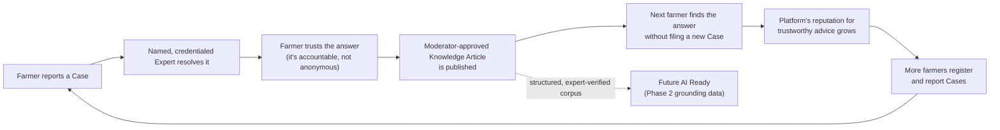
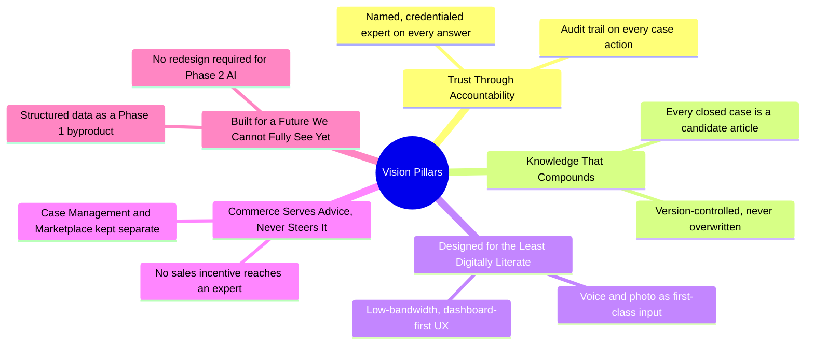

# 01 — Product Vision

**Document Type:** Product Strategy Document
**Document Owner:** Product Office
**Status:** Approved
**Version:** 1.0.0
**Classification:** Internal — Strategic Planning
**Series Position:** Document 2 of the Organic Carbon Farming documentation series

---

## Document Control

| Field | Value |
|---|---|
| Document ID | AGRI-PROD-001 |
| Document Name | Product Vision |
| Version | 1.0.0 |
| Status | Approved |
| Author | Product Office |
| Reviewers | Project Sponsor / Product Owner (approved 2026-08-06) |
| Approval Authority | Project Sponsor / Product Owner |
| Parent Document | [`000-Project-Charter.md`](../000-Project-Charter.md) (Approved, v1.0.0) |
| Related Documents | `01-Product/02-Mission.md`, `01-Product/03-Business-Goals.md`, `01-Product/04-Product-Roadmap.md` (not yet written) |

### Revision History

| Version | Date | Author | Description |
|---|---|---|---|
| 1.0.0 | 2026-08-06 | Product Office | Initial Vision document, elaborating Section 2 of the approved Project Charter into five Vision Pillars, a trust-flywheel model, and vision-level requirements |
| 1.0.0 | 2026-08-06 | Project Sponsor / Product Owner | Reviewed and approved without changes |

---

## 1. Introduction

The Project Charter (`000-Project-Charter.md`) established, in one paragraph, what this platform is for: *"To become the trusted digital front door between every farmer and the agricultural knowledge, expertise, and inputs they need to farm profitably, sustainably, and with confidence."*

A one-paragraph vision is necessary but not sufficient. It cannot, by itself, resolve the questions a product team faces every week: *Does this feature belong in Phase 1? Should the Marketplace team or the Case Management team get the next engineering sprint? Is a WhatsApp bot that pre-answers common questions a good idea, or does it quietly violate the whole premise of the platform?*

This document exists to answer those questions before they are asked — by decomposing the Charter's single vision sentence into a small, durable set of **Vision Pillars**, a model of *how* the vision is supposed to create value over time (the **trust flywheel**), and a set of vision-level requirements and rules that every subsequent product, business, and engineering document must trace back to.

Where the Charter answers *"what is this platform, and what will it do in Phase 1?"*, this document answers *"why will farmers, experts, and the business all keep choosing this platform over the alternatives — and how do we know, feature by feature, whether we're still building toward that?"*

---

## 2. Scope

**In scope for this document:**
- The full articulation of the Vision Statement and its underlying Vision Pillars
- The causal model (trust flywheel) that explains how the vision is intended to compound over time
- Vision-level functional and non-functional requirements — capability *themes*, not detailed feature specifications
- Business rules governing how the vision is applied to prioritization and communication
- Risks specific to the vision being realized (as distinct from Charter-level delivery risks)

**Out of scope for this document** (covered elsewhere):
- Detailed feature requirements → `03-Requirements/`
- Measurable success targets and instrumentation → `01-Product/07-Success-Metrics.md`
- Organizational mission and business goals → `01-Product/02-Mission.md`, `01-Product/03-Business-Goals.md`
- Module-by-module scope and the Phase 1/Phase 2 boundary → already fixed in `000-Project-Charter.md`, Sections 9–11, and not re-litigated here

---

## 3. Objectives

By the end of this document, any reader — engineer, new hire, investor, or partner — should be able to:

1. State the Vision Statement and explain each of the five Vision Pillars in their own words
2. Explain the trust flywheel and why Phase 1 is deliberately human-only rather than AI-first
3. Evaluate a proposed feature against the Vision Pillars and reach a defensible "belongs" / "doesn't belong" judgment
4. Recognize the difference between a Charter-level constraint (fixed, non-negotiable) and a vision-level tension (real, ongoing, requires judgment)

---

## 4. Definitions

| Term | Definition |
|---|---|
| **Vision Statement** | The single-sentence articulation of the platform's ultimate purpose, fixed in Charter Section 2 and not restated differently here. |
| **Vision Pillar** | One of five durable, load-bearing beliefs that the Vision Statement decomposes into. Pillars are stable across phases; features and tactics are not. |
| **Trust Flywheel** | The causal loop by which a Case resolved by a trusted expert becomes reusable Knowledge, which increases farmer trust and adoption, which generates more Cases — see [Section 6](#6-the-trust-flywheel). |
| **Cold Start** | The period before the trust flywheel has enough Cases and Knowledge Articles to be self-sustaining, during which the platform must rely on seeded content rather than organic momentum. |
| **Vision Alignment** | The property of a proposed feature or initiative being traceable to at least one Vision Pillar, per [BR-V1](#7-business-rules). |

All domain terms not defined here (Case, Expert, Moderator, Knowledge Article, etc.) carry the exact meaning fixed in the Charter's Glossary (Section 20) and are used identically in this document.

---

## 5. The Vision Statement

> **To become the trusted digital front door between every farmer and the agricultural knowledge, expertise, and inputs they need to farm profitably, sustainably, and with confidence.**

Three words in that sentence carry the entire strategy, and are worth pulling apart deliberately:

- **"Trusted"** — not merely used, not merely convenient. A farmer's alternative today is a phone call to a neighbor, an unlicensed input dealer, or an anonymous WhatsApp group. All three are *available*; none are reliably *trustworthy*. The platform does not compete on availability — it competes on the fact that an answer given here is traceable to a named, credentialed expert and stays true after the sale.
- **"Front door"** — not the only door. The platform does not need to replace extension officers, cooperatives, or agri-input dealers to succeed; it needs to be the *first* place a farmer goes when they have a problem or a question, ahead of the informal channels that dominate today.
- **"Knowledge, expertise, and inputs"** — three distinct value streams (Learning Management, Case Management, Marketplace) that must reinforce, not cannibalize, one another. A platform that sells products at the expense of honest advice, or that gives advice with no way to act on it, satisfies only part of the sentence.

### A Day in the Life

Concreteness disciplines vision statements better than abstraction does. Consider Ravi, a smallholder farmer growing chilli on a two-acre plot:

Ravi notices unusual leaf curling on part of his field. Today, his options are a call to a cousin who farms nearby, a post in a regional WhatsApp group, or a visit to the local input shop — whose advice is not obviously separable from what they are trying to sell him.

On the platform: Ravi opens the app, sees his Dashboard (membership status, prior cases, recent articles), and taps **Report a Case**. He selects *Disease*, photographs the affected leaves, and adds a short voice note in Telugu describing when it started. He receives a Case Number immediately. Within a day, a credentialed agricultural expert — not a chatbot — reviews the evidence, may ask one follow-up question, and delivers a diagnosis and a treatment plan. Ravi confirms the solution worked. If he needs the recommended input, he can order it in the same session — but the expert who diagnosed his crop had no stake in that sale.

Weeks later, a Moderator has approved that case as a Knowledge Article. The next farmer with curling chilli leaves in the same district finds the answer in seconds, without needing an expert's time at all.

That final sentence is the entire point of Phase 1's data discipline: **the first farmer's case is expensive to answer; the thousandth farmer's identical case should be nearly free.**

---

## 6. The Trust Flywheel

The Vision Statement describes an end state. This section describes the mechanism that is supposed to get the platform there — and, critically, *why Phase 1 is deliberately non-AI*.

Each turn of this loop does two things at once: it serves the farmer in front of the system *today*, and it deposits a structured, expert-verified data asset for *tomorrow*. This is why the platform does not need AI to start compounding in value — the loop runs entirely on human expertise in Phase 1, and Phase 2 AI is additive fuel for an already-spinning flywheel, not the spark that starts it.

**Why this justifies the Charter's "no AI in Phase 1" decision, in vision terms:** if the very first turns of this flywheel were AI-generated, an unproven trust signal, the "trusted" word in the Vision Statement would be unearned. Phase 1's discipline is not caution for its own sake — it is the deliberate choice to prove the loop works with a trust signal (a named human expert) that needs no further justification, before adding a second, less-proven trust signal (AI) on top of it.

**The known failure mode of this model is Cold Start** ([Section 12](#12-risks)): the loop above requires an initial stock of Cases and Knowledge Articles before it can run on its own momentum. The Charter's Learning Management module and "success stories" content (see the reference wireframe informing early design) exist precisely to give farmers a reason to arrive *before* the Knowledge Repository has enough depth to be self-sustaining.

---

## 7. Vision Pillars

Each pillar is stable across Phase 1 and Phase 2; only the *tactics* underneath a pillar change as the platform matures.

| # | Pillar | What It Means in Practice | Traces to Charter |
|---|---|---|---|
| P1 | **Trust Through Accountability** | Every piece of advice is attributable to a named, credentialed human expert; every material action is audit-logged. | Guiding Principle: Audit Friendly; Module 10 expert credentialing (v0.4.0) |
| P2 | **Knowledge That Compounds** | Every resolved Case is a candidate for permanent, structured, reusable knowledge — gated by a Moderator, never overwritten. | Module 3; Knowledge Article Publication Workflow |
| P3 | **Designed for the Least Digitally Literate** | If a flow only works for a smartphone-fluent, literate, urban user, it has failed. Voice and photo are first-class inputs, not fallbacks. | Product Philosophy #3; Constraints C2, C3 |
| P4 | **Commerce Serves Advice, Never Steers It** | Case Management and Marketplace are functionally and organizationally separate; no expert has a sales incentive. | Guiding Principle: Advisory Independence |
| P5 | **Built for a Future We Cannot Fully See Yet** | Every Phase 1 data model captures structured, labeled information as a byproduct of normal operation, so Phase 2 AI is additive, not a rewrite. | Guiding Principle: Future AI Ready; Objectives O12, O14 |

### 7.1 Decision Record: Prioritization Lens

| Field | Value |
|---|---|
| Decision ID | DR-V001 |
| Decision | When two initiatives compete for the same engineering capacity, the one that most strengthens the trust flywheel (Section 6) is prioritized by default. |
| Date | 2026-08-06 |
| Alternatives Considered | (a) Pure revenue impact, (b) pure engagement/DAU impact, (c) whichever stakeholder asks loudest |
| Rationale | Revenue and engagement are Business Goals ([Charter Section 5](../000-Project-Charter.md#5-business-goals)), not the Vision itself. Optimizing for them directly, without the flywheel as a check, is exactly the failure mode Pillar P4 exists to prevent. |
| Status | Adopted; overridable only by joint Sponsor + Product Owner sign-off, logged as a new Decision Record |

---

## 8. Business Rules

| ID | Rule | Rationale |
|---|---|---|
| BR-V1 | Every feature or module proposal entering the backlog must be traceable to at least one Vision Pillar (P1–P5) before it can be scheduled. | Prevents the same scope-creep failure mode the Charter guards against at the phase level ([Charter R10](../000-Project-Charter.md#14-risks)), applied at the feature level. |
| BR-V2 | The Vision Statement itself changes only via joint Project Sponsor + Product Owner sign-off, recorded as a new Decision Record in this document. | The Vision Statement is the root of the traceability chain every other document depends on; it cannot drift silently. |
| BR-V3 | No public-facing copy, marketing material, or in-app text may state or imply that Phase 1 advice is AI-generated. | Directly enforces Pillar P1 and Charter Constraint C1; false claims here would retroactively invalidate the trust the flywheel depends on. |
| BR-V4 | Any feature that would let a paying customer's tier influence which expert or how fast a Case is triaged must be explicitly reviewed against Pillar P4 before approval, not assumed acceptable because it is revenue-positive. | Membership tiers are an open business question ([Charter risk-adjacent note](../000-Project-Charter.md)); this rule ensures monetization design doesn't silently erode Advisory Independence. |

### 8.1 Vision Alignment Checklist

To be run on every feature proposal before it enters `03-Requirements/`:

- [ ] Which Vision Pillar(s) does this strengthen?
- [ ] Does this touch Case Management or the Knowledge Repository in a way that could weaken Pillar P1 (accountability) or P2 (compounding knowledge)?
- [ ] Does this create — even indirectly — a commercial incentive reaching an expert or moderator? (P4)
- [ ] Is the primary interaction achievable by voice or photo alone, or does it silently assume text literacy? (P3)
- [ ] Does this capture data in a structured, labeled form, or does it create an unstructured dead end? (P5)

---

## 9. Functional Requirements

These are vision-level capability *themes* — every one of them is elaborated into concrete, testable requirements in `03-Requirements/`. They exist here to anchor those later requirements to something more durable than a sprint backlog.

| ID | Requirement |
|---|---|
| FR-V1 | The platform SHALL attribute every Case resolution to a single, named, credentialed human expert throughout Phase 1. |
| FR-V2 | The platform SHALL make the knowledge underlying every Moderator-approved, Closed Case discoverable to other farmers without requiring them to file a new Case. |
| FR-V3 | The platform SHALL treat photo, voice, and video as first-class Case-evidence input modes, with parity of prominence to text — not as secondary or degraded options. |
| FR-V4 | The platform SHALL prevent any UI, workflow, or incentive structure from placing a Marketplace recommendation inside the Case Management resolution flow. |
| FR-V5 | The platform SHALL persist every Case, Knowledge Article, and Feedback record with the structured metadata (category, crop, region, tags) needed for Phase 2 AI grounding, as a normal consequence of Phase 1 operation — not as separate cleanup work. |

---

## 10. Non-Functional Requirements

| ID | Quality Attribute | Requirement |
|---|---|---|
| NFR-V1 | Trustworthiness | Every farmer-visible answer must display the responding expert's name and credential status; anonymized or unattributed advice is not permitted in Phase 1. |
| NFR-V2 | Inclusivity | Core farmer flows (Case submission, Case tracking, Learning access) must be completable by a farmer who cannot comfortably read or type in the app's primary language. |
| NFR-V3 | Resilience | Core farmer flows must degrade gracefully, not fail, under intermittent low-bandwidth mobile connectivity (per Charter C3). |
| NFR-V4 | Longevity | The Vision Pillars must remain valid and unreinterpreted through Phase 2's introduction of AI — a pillar that requires wholesale reinterpretation to accommodate AI was mis-specified. |
| NFR-V5 | Auditability | Any farmer, regulator, or internal auditor must be able to trace a piece of published knowledge back to the specific Case, expert, and Moderator approval that produced it. |

---

## 11. Assumptions

| # | Assumption | Impact if Invalid |
|---|---|---|
| AV1 | Farmers place more trust in a named human expert than in an anonymous or automated source, at least at launch. | If false, the entire rationale for a human-only Phase 1 (and thus much of Pillar P1) weakens — this should be validated with real usability research, not assumed indefinitely. |
| AV2 | A meaningful fraction of resolved Cases generalize well enough to become useful Knowledge Articles for other farmers (i.e., problems repeat across farmers more than they are wholly unique). | If false, the trust flywheel's compounding effect (Section 6) is much weaker than modeled, and the platform's defensibility rests on service quality alone, not on an accumulating knowledge asset. |
| AV3 | The organization is willing to seed the platform with enough initial content (success stories, curated articles, expert time) to survive Cold Start before the flywheel is self-sustaining. | If false, Cold Start risk ([Section 12](#12-risks)) becomes a launch blocker, not a manageable early-stage risk. |

---

## 12. Constraints

| # | Constraint | Source |
|---|---|---|
| CV1 | No Vision Pillar may be satisfied through AI-generated advice in Phase 1. | Charter Constraint C1 |
| CV2 | The Vision Statement and Pillars may not be used to justify scope that falls outside the Charter's approved Phase 1 boundary (Charter Section 10.2); vision alignment is necessary but not sufficient for a feature to be built now. | Charter Section 10.2, Risk R10 |
| CV3 | Any change to a Vision Pillar requires the same joint Sponsor + Product Owner approval as a Charter revision, given every downstream document traces back to this one. | BR-V2 |

---

## 13. Risks

| # | Risk | Likelihood | Impact | Mitigation |
|---|---|---|---|---|
| RV1 | **Cold Start** — insufficient Cases/Knowledge Articles exist at launch for the trust flywheel to be visibly working, so early farmers see an empty, unconvincing platform. | Medium | High | Seed the Knowledge Repository with curated expert content and success stories before public launch, per Charter Module 5/8 scope; track Knowledge Reuse ([Charter Section 6](../000-Project-Charter.md#6-success-criteria)) from week one. |
| RV2 | **Vision-Reality Gap** — marketing or sales language overstates Phase 1 capability (implying AI, implying instant answers), damaging the exact trust the vision depends on when reality falls short. | Medium | High | BR-V3 is a hard gate on public-facing copy; Product Office reviews all launch materials against Pillar P1 before publication. |
| RV3 | **Pillar Conflict** — Business Goal "Marketplace Revenue" ([Charter Section 5](../000-Project-Charter.md#5-business-goals)) creates organizational pressure that erodes Pillar P4 in small increments (a "recommended product" here, a commission structure there) without any single change looking like a violation. | Medium | High | DR-V001 and BR-V4 exist specifically to make this an explicit, logged decision rather than a silent drift; Advisory Independence is reviewed at each phase gate. |
| RV4 | **Flywheel Assumption Failure** — AV1 or AV2 turn out to be wrong in the target market, and the compounding model in Section 6 simply doesn't hold. | Low-Medium | Critical | Treat AV1/AV2 as hypotheses to validate early (first-season usability research and Knowledge Reuse tracking), not settled facts; be prepared to revisit this document, not just tactics, if they fail. |

---

## 14. Future Enhancements

- **Phase 2 reinterpretation check:** when AI-assisted search and RAG are introduced, re-run this document's Vision Alignment Checklist against Pillar P1 specifically — the framing of "who gets credit and accountability for an AI-assisted answer" needs to be resolved explicitly, not left ambiguous.
- **Vision Pillar P6 candidate (not yet adopted):** a future "Ecosystem Trust" pillar may be warranted once Phase 3 partner integrations (agri-credit, insurance) are pursued, since those extend the trust relationship beyond the platform's own advice to third-party financial products.
- **Quantified flywheel model:** once real usage data exists, Section 6's qualitative loop should be paired with an actual quantitative model (cases → articles → deflection rate → retention) in `01-Product/07-Success-Metrics.md`.

---

## 15. References

- [`000-Project-Charter.md`](../000-Project-Charter.md) — Approved v1.0.0; parent document, source of the Vision Statement (Section 2), Guiding Principles (Section 15), Product Philosophy (Section 16), and all domain terminology
- [`diagrams/phase1-platform-flow.html`](../diagrams/phase1-platform-flow.html) — Farmer journey and Case Lifecycle diagrams referenced in the Day in the Life example
- `01-Product/02-Mission.md` — pending; translates this Vision into the immediate Phase 1 operating mandate
- `01-Product/03-Business-Goals.md` — pending; organizational outcomes distinct from, but constrained by, the Vision Pillars in this document
- `01-Product/07-Success-Metrics.md` — pending; will quantify the trust flywheel described in Section 6

---

## Approval

| Approver | Role | Decision | Date |
|---|---|---|---|
| Session Owner | Project Sponsor / Executive Owner | Approved | 2026-08-06 |
| Session Owner | Product Owner | Approved | 2026-08-06 |

---

*End of Document 01-Vision, v1.0.0 — Approved. Next: `01-Product/02-Mission.md`.*
