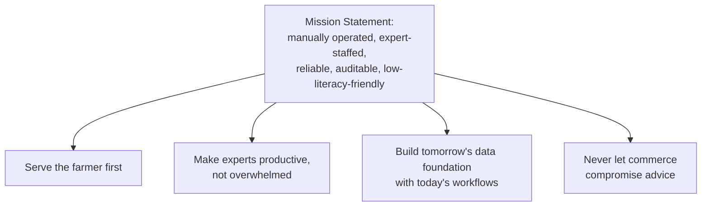

# 02 — Product Mission

**Document Type:** Product Strategy Document
**Document Owner:** Product Office
**Status:** Approved
**Version:** 1.0.0
**Classification:** Internal — Strategic Planning
**Series Position:** Document 3 of the Digital Agriculture Knowledge & Advisory Platform documentation series

---

## Document Control

| Field | Value |
|---|---|
| Document ID | AGRI-PROD-002 |
| Document Name | Product Mission |
| Version | 1.0.0 |
| Status | Approved |
| Author | Product Office |
| Reviewers | Project Sponsor / Product Owner (approved 2026-08-06) |
| Approval Authority | Project Sponsor / Product Owner |
| Parent Documents | [`000-Project-Charter.md`](../000-Project-Charter.md) (Approved, v1.0.0), [`01-Product/01-Vision.md`](01-Vision.md) (Approved, v1.0.0) |
| Related Documents | `01-Product/03-Business-Goals.md`, `01-Product/07-Success-Metrics.md` (not yet written) |

### Revision History

| Version | Date | Author | Description |
|---|---|---|---|
| 1.0.0 | 2026-08-06 | Product Office | Initial Mission document, elaborating Section 3 of the approved Project Charter into four Mission Principles with owners, leading indicators, and an operating cadence |
| 1.0.0 | 2026-08-06 | Project Sponsor / Product Owner | Reviewed and approved without changes |

---

## 1. Introduction

The Vision document (`01-Vision.md`) answers *why the platform exists* and *what has to stay true for decades*. This document answers a narrower, more urgent question: **what has to happen every single week, starting now, for the Vision to have a chance of coming true?**

A Vision Pillar can be violated slowly, invisibly, over many small decisions — a slightly-too-fast expert assignment here, a slightly-too-prominent product recommendation there — none of which look like a violation in isolation. The Mission exists to convert the Vision's five durable beliefs into a small number of **operating principles with named owners, leading indicators, and a review cadence**, so drift is caught in weeks, not discovered in a postmortem a year later.

Where the Charter fixed the Mission *statement* (Section 3) as a governance-level commitment, this document is the operating manual underneath that statement.

---

## 2. Scope

**In scope:**
- The Mission Statement and its four Mission Principles, each with an accountable owner and a leading indicator
- The operating cadence (reviews, rituals) that keeps the organization honest against the Mission
- Mission-level functional and non-functional requirements — operational capabilities the *organization* needs from the platform to execute the Mission, distinct from the farmer-facing capabilities defined in the Vision document
- The explicit distinction between Vision, Mission, and Phase Gate Criteria, since these are easy to conflate

**Out of scope:**
- Long-term aspirational framing → `01-Product/01-Vision.md`
- Organizational revenue/growth targets → `01-Product/03-Business-Goals.md`
- Quantified, instrumented metrics and dashboards → `01-Product/07-Success-Metrics.md`
- The Phase 1 → Phase 2 transition gate, which is already fixed in Charter Section 18.3 and is not re-specified here

---

## 3. Objectives

After reading this document, a reader should be able to:

1. State each Mission Principle, its accountable owner, and the one number that would reveal if it's being violated
2. Explain the difference between a Vision Pillar (durable, aspirational) and a Mission Principle (operational, reviewed weekly/monthly)
3. Run the operating cadence in [Section 8](#8-operating-cadence) without needing to be told to
4. Recognize "ritual decay" ([Section 14](#14-risks)) as a named failure mode, not an abstract worry

---

## 4. Definitions

| Term | Definition |
|---|---|
| **Mission Statement** | The Phase 1 operating commitment fixed in Charter Section 3, restated in [Section 5](#5-the-mission-statement) but not altered here. |
| **Mission Principle** | One of four operating rules that translate the Mission Statement into weekly/monthly organizational behavior, each with a named owner and leading indicator. |
| **Leading Indicator** | A number that can be checked *before* a Mission Principle is violated in a way that hurts a farmer or the business — as opposed to a lagging indicator, which confirms the damage after the fact. |
| **Ritual Decay** | The failure mode where a defined operating cadence (a review, a check) is skipped often enough, for long enough, that it silently stops functioning as a safeguard — see [Section 14](#14-risks). |
| **Operating Cadence** | The recurring set of reviews and checks defined in [Section 8](#8-operating-cadence) that keep the Mission Principles enforced in practice, not just on paper. |

Domain terms (Case, Expert, Moderator, SLA, etc.) carry the exact meaning fixed in the Charter Glossary (Section 20).

---

## 5. The Mission Statement

> **In Phase 1, we will deliver a manually operated, expert-staffed digital advisory and learning platform that is reliable, auditable, and easy enough for a low-digital-literacy farmer to use — while capturing every interaction in a structured form that makes the platform progressively smarter without ever making the farmer wait for a machine to be ready.**

This is fixed in Charter Section 3 and is not restated differently here. What follows is the operational decomposition of it.

---

## 6. Vision, Mission, and Phase Gate — How They Differ

These three documents are easy to conflate because they all reference the same underlying platform. They answer different questions, on different timescales, and a reader should never need to guess which one governs a given decision:

| | Vision (`01-Vision.md`) | Mission (this document) | Phase Gate (Charter §18.3) |
|---|---|---|---|
| **Question answered** | Why does this platform exist, forever? | What must the organization *do*, every week, right now? | When are we allowed to start Phase 2? |
| **Timescale** | Multi-year, stable across phases | Ongoing, reviewed weekly/monthly | A one-time transition decision |
| **Changes when** | Almost never (Charter/Sponsor-gated) | As operating maturity grows (Product Owner-gated) | Once, when evidence supports it |
| **Owned by** | Product Office / Sponsor | Product Office + functional owners (§7) | Project Sponsor |

---

## 7. Mission Principles

| # | Principle | Accountable Owner | What It Forbids | Leading Indicator |
|---|---|---|---|---|
| MP1 | **Serve the farmer first** | Product Office | Shipping a flow that only works for a literate, urban, smartphone-fluent user | % of core farmer flows (Case submission, tracking, Learning access) usability-tested with a low-literacy persona before release |
| MP2 | **Make experts productive, not overwhelmed** | Administration (Module 10) | Growing farmer/marketing acquisition faster than expert capacity can absorb | Per-expert active case load vs. defined capacity threshold, checked weekly |
| MP3 | **Build tomorrow's data foundation with today's workflows** | Architecture Office | Treating structured metadata (crop, category, tags) as optional or "backfill later" | % of Closed cases with complete structured metadata at time of closure, not after cleanup |
| MP4 | **Never let commerce compromise advice** | Product Owner | Any UI, workflow, or incentive placing a Marketplace signal inside an open Case's resolution thread | Count of Marketplace-originated UI elements present anywhere inside the Case Management module (target: zero) |

Each of these is the operational sibling of a Vision Pillar (`01-Vision.md`, Section 7): MP1↔P3, MP2↔P1 (expert capacity underwrites accountable, timely trust), MP3↔P2 and P5, MP4↔P4. This mapping should be treated as fixed — if a future revision proposes a Mission Principle with no corresponding Vision Pillar, that is a signal the Vision document is incomplete, not that the Mission has outgrown it.

---

## 8. Operating Cadence

A principle with no review cadence behind it is a poster on a wall. The following cadence is the minimum required to keep Section 7 enforced in practice:

| Cadence | Review | Owner | Checks |
|---|---|---|---|
| Weekly | Expert Capacity Review | Administration | MP2 leading indicator; any expert at/above threshold triggers reassignment or a hiring flag before new marketing spend is approved (ties to [BR-M2](#9-business-rules)) |
| Weekly | SLA Breach Review | Administration + affected Experts | Cases breaching the Charter's response/closure SLA targets ([Charter §6](../000-Project-Charter.md#6-success-criteria)), reviewed same-operating-day per [FR-M2](#10-functional-requirements) |
| Monthly | Data Completeness Audit | Architecture Office | MP3 leading indicator; any subsystem shipping cases with incomplete metadata is flagged to Engineering, not silently tolerated |
| Monthly | Advisory Independence Audit | Product Owner | MP4 leading indicator; a manual review of every UI surface inside Case Management for commerce bleed-through |
| Quarterly | Low-Literacy Usability Testing | Product Office | MP1 leading indicator; re-tests core flows with representative low-literacy farmer personas, not just at initial launch |

---

## 9. Business Rules

| ID | Rule | Protects |
|---|---|---|
| BR-M1 | A Case may not be auto-assigned to an expert already at or above their defined capacity threshold without explicit Moderator override. | MP2 |
| BR-M2 | No marketing or growth initiative that could materially increase Case volume may launch without a passing Weekly Expert Capacity Review in the preceding cycle. | MP2 |
| BR-M3 | A subsystem or feature that ships without the required structured metadata fields on Case/Knowledge Article creation fails QA; "we'll backfill it later" is not an accepted exception. | MP3 |
| BR-M4 | Commerce/Marketplace teams may not request UI placement inside the Case Management resolution flow. Any exception requires Sponsor sign-off, logged as a Decision Record in the style of [Vision §7.1](01-Vision.md#71-decision-record-prioritization-lens). | MP4 |

---

## 10. Functional Requirements

Unlike the Vision document's farmer-facing requirements, these are requirements the *organization* needs from the platform in order to execute the Mission:

| ID | Requirement |
|---|---|
| FR-M1 | The platform SHALL expose per-expert active case load (Assigned + Expert Working + Waiting Farmer counts) to Administration in near-real-time, without requiring an ad hoc database query. |
| FR-M2 | The platform SHALL surface any Case that has breached its defined SLA to both Administration and the assigned Expert within the same operating day it occurs. |
| FR-M3 | The platform SHALL require structured metadata (crop, category, region, tags — drawn from the Module 14 taxonomy) as a mandatory condition of Case closure, not an optional field completed later. |
| FR-M4 | The platform SHALL technically prevent, not merely style-guide-discourage, any Marketplace UI component from being rendered inside the Case Management resolution thread. |
| FR-M5 | The platform SHALL support onboarding (registration, first Case submission, first course access) via voice- and photo-guided steps, verifiable without requiring the tester to read the interface language. |

---

## 11. Non-Functional Requirements

| ID | Quality Attribute | Requirement |
|---|---|---|
| NFR-M1 | Operational Transparency | Case SLA status must be visible to Administration without a manual reporting request. |
| NFR-M2 | Staffing Elasticity | Experts can be added, removed, or have their caseload reassigned without downtime or a data migration. |
| NFR-M3 | Data Completeness | The platform must structurally prevent (not just discourage) a Case from closing without its required metadata fields — this is the mechanism behind MP3, not merely a target. |
| NFR-M4 | Onboarding Accessibility | A first-time, low-literacy farmer must be able to complete registration and submit a first Case using only voice/photo guidance, within a bounded time — the specific target is set in `01-Product/07-Success-Metrics.md`, not here. |

---

## 12. Assumptions

| # | Assumption | Impact if Invalid |
|---|---|---|
| AM1 | Initial expert headcount and each expert's realistic weekly case capacity are knowable and planned quantities, not guesswork. | If false, MP2's leading indicator has no meaningful threshold to check against, and BR-M1/BR-M2 become unenforceable in practice. |
| AM2 | Administration and the Product Office will actually run the cadence in [Section 8](#8-operating-cadence), not merely agree it's a good idea. | If false, every Mission Principle silently degrades to a Vision Pillar with no operational teeth — see Ritual Decay, [Section 14](#14-risks). |
| AM3 | The organization is willing to say no to growth (BR-M2) when expert capacity review fails, even under commercial pressure. | If false, MP2 is a principle that exists only until the first time it's inconvenient — worth surfacing to the Sponsor now, not discovering under pressure later. |

---

## 13. Constraints

| # | Constraint | Source |
|---|---|---|
| CM1 | The operating cadence in Section 8 must run using only Phase 1 platform capabilities (Reporting, Administration) — it may not assume tooling or a BI platform that isn't part of the approved Phase 1 scope. | Charter §10.1 |
| CM2 | Mission Principles may not be used to justify scope outside the Charter's Phase 1 boundary, in either direction — they govern *how* Phase 1 is run, not *what* is in it. | Charter §10.2 |

---

## 14. Risks

| # | Risk | Likelihood | Impact | Mitigation |
|---|---|---|---|---|
| RM1 | **Ritual Decay** — the weekly/monthly reviews in Section 8 are followed diligently for the first few months and then quietly skipped as the organization scales or turns over, silently reintroducing every risk the Mission Principles were meant to prevent. | Medium-High | High | Assign the cadence to a role, not a person (Section 7's "Accountable Owner" column), so it survives individual turnover; treat two consecutive skipped reviews as an escalation trigger to the Product Owner. |
| RM2 | **Visibility Without Accountability** — FR-M1/FR-M2 give Administration the data to see capacity and SLA problems, but nobody is actually obligated to act on what they see. | Medium | High | BR-M1/BR-M2 convert visibility into a hard gate (no new marketing spend, no unauthorized over-assignment) rather than leaving action discretionary. |
| RM3 | **Commercial Pressure Override** — a revenue shortfall creates organizational pressure to relax MP2 (overload experts to capture more Case volume) or MP4 (let Marketplace into the Case flow "just this once"). | Medium | Critical | Both are protected by explicit Decision Record requirements (BR-M4) and Sponsor-level sign-off, making an override visible and logged rather than quiet. |

---

## 15. Future Enhancements

- **Phase 2 cadence review:** once AI-assisted triage exists, the Weekly Expert Capacity Review (Section 8) needs to explicitly separate "AI-assisted deflection" from "genuine spare human capacity" — conflating the two would quietly violate MP2's original intent.
- **Formal Ops dashboard:** the manual reviews in Section 8 are the Phase 1 minimum; `01-Product/07-Success-Metrics.md` and the eventual Reporting module (Charter Module 11) should absorb them into an always-on dashboard rather than a recurring meeting, once volume justifies it.

---

## 16. References

- [`000-Project-Charter.md`](../000-Project-Charter.md) — Approved v1.0.0; source of the Mission Statement (Section 3), Success Criteria (Section 6), and Phase Gate Criteria (Section 18.3)
- [`01-Product/01-Vision.md`](01-Vision.md) — Approved v1.0.0; source of the Vision Pillars each Mission Principle maps to
- `01-Product/03-Business-Goals.md` — pending; organizational outcomes the Mission's cadence must not silently undermine
- `01-Product/07-Success-Metrics.md` — pending; will formalize the leading indicators in Section 7 into instrumented, targeted metrics

---

## Approval

| Approver | Role | Decision | Date |
|---|---|---|---|
| Session Owner | Project Sponsor / Executive Owner | Approved | 2026-08-06 |
| Session Owner | Product Owner | Approved | 2026-08-06 |

---

*End of Document 02-Mission, v1.0.0 — Approved. Next: `01-Product/03-Business-Goals.md`.*
