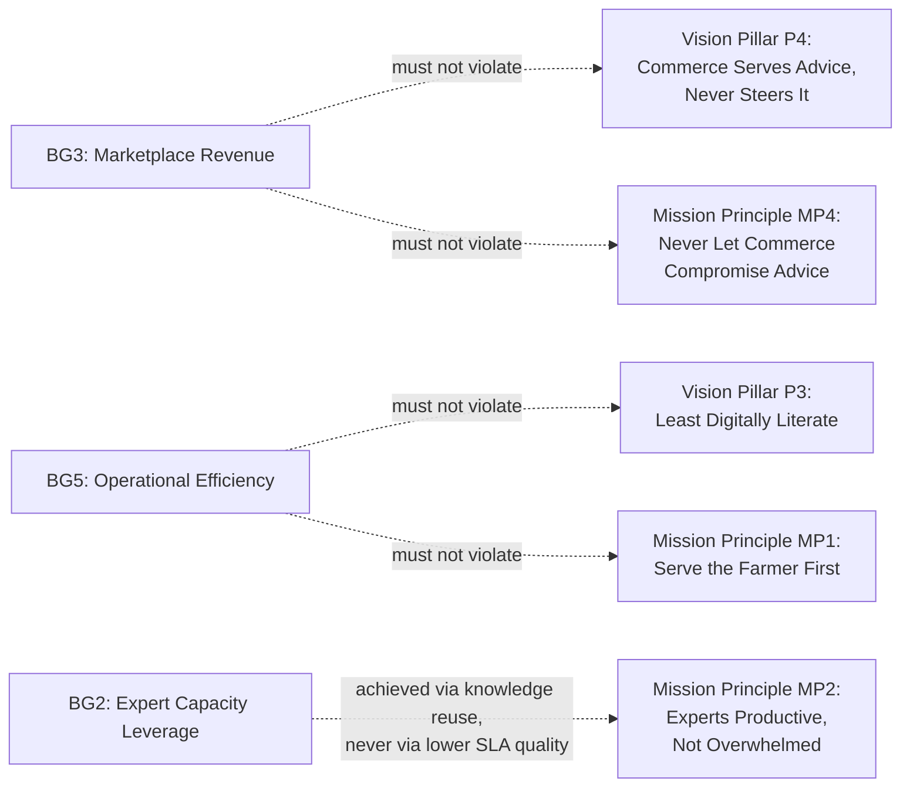

# 03 — Business Goals

**Document Type:** Product Strategy Document
**Document Owner:** Product Office
**Status:** Approved
**Version:** 1.0.0
**Classification:** Internal — Strategic Planning
**Series Position:** Document 4 of the Digital Agriculture Knowledge & Advisory Platform documentation series

---

## Document Control

| Field | Value |
|---|---|
| Document ID | AGRI-PROD-003 |
| Document Name | Business Goals |
| Version | 1.0.0 |
| Status | Approved |
| Author | Product Office |
| Reviewers | Project Sponsor / Product Owner (approved 2026-08-06) |
| Approval Authority | Project Sponsor / Product Owner |
| Parent Documents | [`000-Project-Charter.md`](../000-Project-Charter.md) (Approved, v1.0.0), [`01-Product/01-Vision.md`](01-Vision.md) (Approved, v1.0.0), [`01-Product/02-Mission.md`](02-Mission.md) (Approved, v1.0.0) |
| Related Documents | `01-Product/04-Product-Roadmap.md`, `01-Product/07-Success-Metrics.md` (not yet written) |

### Revision History

| Version | Date | Author | Description |
|---|---|---|---|
| 1.0.0 | 2026-08-06 | Product Office | Initial Business Goals document, elaborating Charter Section 5 into targeted, owned goals with explicit guardrails against the Vision/Mission principles they could erode |
| 1.0.0 | 2026-08-06 | Project Sponsor / Product Owner | Reviewed and approved without changes |

---

## 1. Introduction

Vision (`01-Vision.md`) answers why the platform exists, forever. Mission (`02-Mission.md`) answers what the organization must do, every week, to be worthy of that. Neither answers the question a Sponsor or investor actually asks: **is this a good business, and how would we know?**

This document exists to answer that question directly — in targets, ownership, and money — while being explicit about the one failure mode this kind of document invites: a business goal, chased hard enough, can quietly erode the very trust it depends on. Every revenue-bearing goal in this document is paired with the specific Vision Pillar or Mission Principle it must not be allowed to violate. That pairing is not a caveat; it is the actual content of the document.

---

## 2. Scope

**In scope:**
- The six Business Goals from Charter Section 5, each elaborated with a target, an accountable owner, and a timeframe
- The platform's revenue model — what actually generates money, and in what proportion
- Explicit guardrails pairing each goal against the Vision Pillar / Mission Principle it could erode if pursued carelessly
- A proposed North Star Metric that indexes whether the whole system (Vision's trust flywheel, Mission's operating discipline) is actually working

**Out of scope:**
- Detailed, instrumented metric definitions and dashboards → `01-Product/07-Success-Metrics.md`
- Phase-by-phase delivery sequencing → `01-Product/04-Product-Roadmap.md`
- Membership pricing/tiering specifics (not yet finalized — see [Assumptions](#12-assumptions)) → `02-Business/03-Membership.md`

---

## 3. Objectives

After reading this document, a reader should be able to:

1. State each Business Goal, its owner, and its target
2. Explain the platform's revenue model and why Marketplace revenue is deliberately kept secondary, not primary
3. Identify, for any new revenue initiative, which Vision Pillar or Mission Principle it needs to be checked against before approval
4. Explain the North Star Metric and why it was chosen over more obvious candidates like revenue or registered-user count

---

## 4. Definitions

| Term | Definition |
|---|---|
| **Business Goal** | One of six organizational outcomes fixed in Charter Section 5 — a *result* the business needs, as distinct from a Vision Pillar (a belief) or a Mission Principle (an operating rule). |
| **Guardrail** | The specific Vision Pillar or Mission Principle a Business Goal must be evaluated against before a new initiative in service of that goal is approved. |
| **North Star Metric** | The single metric this document nominates as the best proxy for whether the platform's core mechanism (the Vision's trust flywheel) is actually functioning, above all other candidate metrics. |
| **Revenue Stream** | A distinct source of platform income, reported separately per [BR-B2](#9-business-rules) so that a shift toward commerce-driven behavior would be visible before it becomes a trust problem. |

All domain terms not defined here carry the exact meaning fixed in the Charter Glossary (Section 20).

---

## 5. The Business Goals

| # | Goal | Target (illustrative) | Timeframe | Owner |
|---|---|---|---|---|
| BG1 | **Farmer Trust & Retention** | ≥1.5 Cases per active farmer per season; ≥60% season-over-season farmer retention | Ongoing from launch, reviewed quarterly | Product Owner |
| BG2 | **Expert Capacity Leverage** | Knowledge Deflection Rate (see [Section 7](#7-north-star-metric)) reaching ≥20% by month 12 | 12 months post-launch | Administration (Module 10) |
| BG3 | **Marketplace Revenue** | Positive contribution margin on Marketplace by month 9; Marketplace revenue capped at no more than 60% of total platform revenue mix (see [Guardrail G3](#6-goal-guardrails)) | 9–12 months post-launch | Commerce Lead |
| BG4 | **Data Moat** | ≥95% of Closed cases with complete structured metadata at closure; ≥500 published Knowledge Articles by month 12 | Ongoing, audited monthly per Mission §8 | Architecture Office |
| BG5 | **Operational Efficiency** | Cost-per-resolved-Case trending downward quarter over quarter, benchmarked against the cost of the informal channels (phone/WhatsApp group/dealer) it replaces | Ongoing from month 3 | Product Owner / Operations |
| BG6 | **Brand & Reputation** | A tracked trust indicator (e.g., post-resolution satisfaction rating average) ≥4.2/5, plus a growing count of externally-referenced success stories | Ongoing, reviewed quarterly | Product Office / Marketing |

These six are fixed at the Charter level ([Charter Section 5](../000-Project-Charter.md#5-business-goals)); this document adds targets and owners, but does not add a seventh goal — any proposed new Business Goal requires a Charter revision, not an addition here, per the same discipline the Charter itself established for objectives and features.

---

## 6. Goal Guardrails

The two goals with the most direct pull toward compromising trust are BG3 (Marketplace Revenue) and BG5 (Operational Efficiency) — both are legitimate, both have caused real platforms to erode the thing that made them valuable in the first place. Each guardrail below is a standing check, not a one-time review.

| Guardrail | Goal | Constraint | What a Violation Looks Like |
|---|---|---|---|
| G1 | BG3 | No Marketplace incentive, commission, or metric may reach an Expert or influence Case assignment. | An expert's bonus tied even indirectly to Marketplace sales generated from their cases. |
| G2 | BG3 | Marketplace revenue is reported as a distinct line from Membership revenue at all times ([BR-B2](#9-business-rules)); the 60% mix cap in BG3's target exists specifically so Marketplace cannot quietly become the platform's primary identity. | Marketing describing the platform primarily as a marketplace with an advisory feature, rather than the reverse. |
| G3 | BG5 | Cost reduction initiatives may not remove or degrade voice/photo input paths, simplified language, or any low-literacy accommodation to save engineering or support cost. | Replacing a voice-guided Case submission flow with a cheaper text-only form to cut development time. |
| G4 | BG2 | Expert capacity is freed up by knowledge deflection (farmers self-serving from the Knowledge Repository) and better tooling — never by lowering the bar for what counts as an adequately resolved Case. | Shortening SLA targets or approving lower-quality Answered states to inflate throughput numbers. |

---

## 7. North Star Metric

**Proposed North Star: Knowledge Deflection Rate** — the percentage of new Cases where the farmer's need is met by an existing Knowledge Article (found via search or shown proactively) without requiring a fresh expert assignment.

**Why this metric, and not revenue or registered users:**

| Candidate | Problem |
|---|---|
| Total registered farmers | Vanity metric — a farmer who registers once and never returns proves nothing about trust. |
| Total revenue | Directly incentivizes BG3 (Marketplace) over BG1 (Trust), the opposite of the priority order the Charter and Vision establish. |
| Case volume | Rewards more problems being reported, not more problems being *solved efficiently* — doesn't distinguish a healthy flywheel from an overloaded one. |
| **Knowledge Deflection Rate** | Directly indexes whether the Vision's trust flywheel (`01-Vision.md`, Section 6) is actually spinning: it only rises if enough farmers trusted the platform, enough cases were resolved and published, and enough new farmers' problems match the accumulated knowledge. It rewards BG1, BG2, and BG4 simultaneously and is structurally indifferent to BG3. |

This metric is expected to be near-zero at launch (Cold Start, per `01-Vision.md` Risk RV1) and its growth curve over the first 12 months is the single best evidence of whether the underlying model works, independent of how much revenue or marketing spend is behind it.

---

## 8. Revenue Model

| Stream | Description | Phase 1 Role |
|---|---|---|
| **Membership** | Farmer subscription/membership fee, tiered (exact tiers and pricing pending — see [Assumptions](#12-assumptions)) | Primary, predictable revenue base |
| **Marketplace** | Transaction margin on agricultural inputs sold through the platform | Secondary, capped per [Guardrail G2](#6-goal-guardrails) |
| **Soil Laboratory** | Fee per soil sample tested (pass-through to lab partner plus platform margin) | Minor, ancillary |
| *Not in Phase 1 scope* | Data licensing, agri-credit/insurance partner referral fees, B2B/white-label — directional only, per Charter Section 17 | Phase 3+ candidate, see [Future Enhancements](#15-future-enhancements) |

---

## 9. Business Rules

| ID | Rule | Protects |
|---|---|---|
| BR-B1 | No revenue target, bonus structure, or compensation plan may create an incentive conflict with Advisory Independence (Vision P4 / Mission MP4). | Guardrail G1 |
| BR-B2 | Membership revenue and Marketplace revenue are reported as distinct figures in every financial and Reporting-module view; they may never be presented as a single blended "platform revenue" number. | Guardrail G2 |
| BR-B3 | BG4's Data Moat metrics are sourced from the same structured fields Mission Principle MP3 already requires at Case closure — no separate, redundant instrumentation effort. | Consistency with `02-Mission.md` |
| BR-B4 | Business Goal targets (Section 5) are reviewed and may be reset quarterly by the Sponsor. Vision Pillars and Mission Principles are never renegotiated to make a missed Business Goal target easier to hit. | Governance precedence: Charter/Vision outrank Business Goals |

---

## 10. Functional Requirements

| ID | Requirement |
|---|---|
| FR-B1 | The Reporting module SHALL display Membership and Marketplace revenue as separate, clearly labeled figures, never combined by default. |
| FR-B2 | The Reporting module SHALL calculate and surface the Knowledge Deflection Rate as a standing metric from the first month of operation, even while its absolute value is near zero. |
| FR-B3 | The Reporting module SHALL track cost-per-resolved-Case as a trend line, not a single point-in-time figure. |
| FR-B4 | The Reporting module SHALL support season-over-season farmer retention cohort tracking for BG1. |

---

## 11. Non-Functional Requirements

| ID | Quality Attribute | Requirement |
|---|---|---|
| NFR-B1 | Reporting Accuracy | Revenue-stream figures must reconcile exactly with the Finance module's (Module 9) ledger — no independently-maintained Reporting-side revenue calculation. |
| NFR-B2 | Timeliness | Business Goal metrics must be no more than 24 hours stale when viewed by the Sponsor or Product Owner. |
| NFR-B3 | Auditability | Every change to a Business Goal target (Section 5) must be logged with who changed it and why, consistent with the Charter's Audit Friendly principle. |

---

## 12. Assumptions

| # | Assumption | Impact if Invalid |
|---|---|---|
| AB1 | Membership tiers and pricing will be finalized in `02-Business/03-Membership.md` before BG1/BG3 targets can be treated as more than illustrative. | Until then, the targets in Section 5 are directional, not committed — this is flagged explicitly rather than presented as settled. |
| AB2 | Sufficient Marketplace vendor supply exists at launch to make BG3 achievable at all. | If false, BG3's 9–12 month timeframe is unrealistic regardless of platform quality, and the Sponsor should be told this is a supply-side risk, not a product risk. |
| AB3 | The organization will genuinely hold to the 60% revenue-mix cap in BG3 even if Marketplace outperforms Membership early. | If false, Guardrail G2 exists on paper only — this is the business-goals-level restatement of Vision Risk RV3 (Pillar Conflict). |

---

## 13. Constraints

| # | Constraint | Source |
|---|---|---|
| CB1 | No Business Goal may be pursued in a way that violates a Charter Guiding Principle, a Vision Pillar, or a Mission Principle — this document is subordinate to all three, not a peer. | Charter Sections 15–16; `01-Vision.md`; `02-Mission.md` |
| CB2 | Business Goal targets may not be used to justify scope outside the Charter's Phase 1 boundary. | Charter Section 10.2 |

---

## 14. Risks

| # | Risk | Likelihood | Impact | Mitigation |
|---|---|---|---|---|
| RB1 | **Revenue Goal Cannibalizes Trust Goal** — BG3 outperforms and organizational attention/investment quietly shifts toward Marketplace at Case Management's expense. | Medium | Critical | Guardrails G1/G2, BR-B1/BR-B2, and the 60% revenue-mix cap in BG3's own target are the explicit controls; the North Star Metric (Section 7) is deliberately indifferent to revenue so this drift shows up immediately in a metric leadership actually watches. |
| RB2 | **Undefined Membership Pricing Blocks Real Targets** — AB1 remains unresolved past launch, leaving BG1/BG3 permanently illustrative rather than actionable. | Medium | Medium | `02-Business/03-Membership.md` is scheduled next in the Business series specifically to close this gap. |
| RB3 | **Data Moat Underdelivers** — BG4's targets assume Mission MP3's metadata discipline holds; if it erodes (Mission Risk RM2), BG4 fails quietly rather than visibly. | Medium | High | BR-B3 ties BG4's metrics directly to MP3's own instrumentation, so a failure in one is immediately visible in the other — no separate blind spot. |
| RB4 | **Premature Marketplace Investment** — pursuing BG3 aggressively before the Core Trust Loop (Charter Risk R11) is proven pulls engineering capacity away from Case Management too early. | Medium | High | The staged delivery sequencing already recommended for R11 treats Marketplace as a later-stage investment, contingent on Core Trust Loop pilot evidence — not a parallel-from-day-one workstream. |

---

## 15. Future Enhancements

- **Phase 3 revenue streams:** data licensing (to Phase 2/3 AI partners, always on the structured-data foundation the platform already builds, never on unconsented raw farmer data), agri-credit/insurance referral fees — both directional in Charter Section 17, not committed here.
- **Phase 4 B2B/white-label revenue:** if the platform is offered as reusable infrastructure to other agricultural organizations (Charter Section 17, Phase 4), this document's revenue model will need a full second stream added, not a footnote.
- **Quantified guardrail enforcement:** once real usage data exists, Guardrail G1 (no commerce incentive reaching experts) should move from a policy/audit control to a technical one — e.g., an automated check that fails a build if any Marketplace API is reachable from the Case Management module.

---

## 16. References

- [`000-Project-Charter.md`](../000-Project-Charter.md) — Approved v1.0.0; source of the six Business Goals (Section 5)
- [`01-Product/01-Vision.md`](01-Vision.md) — Approved v1.0.0; source of Vision Pillars P3/P4 referenced in Section 6's guardrails
- [`01-Product/02-Mission.md`](02-Mission.md) — Approved v1.0.0; source of Mission Principles MP1/MP2/MP4 referenced in Section 6's guardrails
- `01-Product/04-Product-Roadmap.md` — pending; will sequence delivery against these goals' timeframes
- `01-Product/07-Success-Metrics.md` — pending; will formalize the North Star Metric and Section 5 targets into instrumented dashboards
- `02-Business/03-Membership.md` — pending; will resolve Assumption AB1 (membership pricing/tiers)

---

## Approval

| Approver | Role | Decision | Date |
|---|---|---|---|
| Session Owner | Project Sponsor / Executive Owner | Approved | 2026-08-06 |
| Session Owner | Product Owner | Approved | 2026-08-06 |

---

*End of Document 03-Business-Goals, v1.0.0 — Approved. Next: `01-Product/04-Product-Roadmap.md`.*
