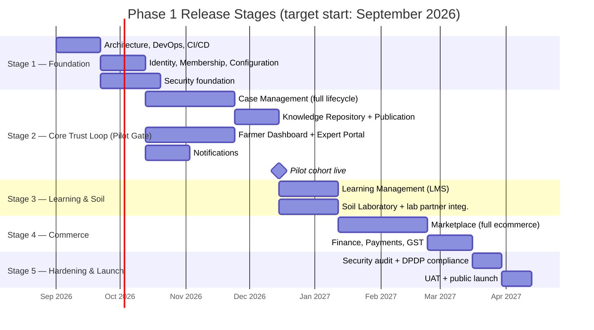

# 04 — Product Roadmap

**Document Type:** Product Strategy Document
**Document Owner:** Product Office
**Status:** Approved
**Version:** 1.0.0
**Classification:** Internal — Strategic Planning
**Series Position:** Document 5 of the Organic Carbon Farming documentation series

---

## Document Control

| Field | Value |
|---|---|
| Document ID | AGRI-PROD-004 |
| Document Name | Product Roadmap |
| Version | 1.0.0 |
| Status | Approved |
| Author | Product Office |
| Reviewers | Project Sponsor / Product Owner (approved 2026-08-06) |
| Approval Authority | Project Sponsor / Product Owner |
| Parent Documents | [`000-Project-Charter.md`](../000-Project-Charter.md) (Approved, v1.0.0), [`01-Product/01-Vision.md`](01-Vision.md) (Approved, v1.0.0), [`01-Product/02-Mission.md`](02-Mission.md) (Approved, v1.0.0), [`01-Product/03-Business-Goals.md`](03-Business-Goals.md) (Approved, v1.0.0) |
| Related Documents | `01-Product/05-Target-Users.md`, `01-Product/07-Success-Metrics.md` (not yet written), [`16-Appendix/Timeline-Technology-Security.md`](../16-Appendix/Timeline-Technology-Security.md) (informal reference this document formalizes) |

### Revision History

| Version | Date | Author | Description |
|---|---|---|---|
| 1.0.0 | 2026-08-06 | Product Office | Initial Product Roadmap, converting the informal `16-Appendix` timeline reference and Charter Risk R11's staged-delivery recommendation into a committed release plan with explicit Go/No-Go gates per stage |
| 1.0.0 | 2026-08-06 | Project Sponsor / Product Owner | Reviewed and approved without changes |

---

## 1. Introduction

Charter Section 17 gives the platform's multi-year strategic trajectory (Phase 1 → 2 → 3 → 4). Charter Section 18 gives the Phase 1 module list and a qualitative Phase-gate description. Neither commits to *when* things happen inside Phase 1, or *what evidence* is required before one stage of Phase 1 build-out hands off to the next.

This document closes that gap. It takes the staged delivery structure already used informally (`16-Appendix/Timeline-Technology-Security.md`) and Charter Risk R11's warning — that Phase 1 bundles four near-independent product surfaces and risks a long time-to-first-value if built as one big-bang release — and turns it into five release stages, each with explicit entry criteria, exit criteria, and a Go/No-Go gate.

---

## 2. Scope

**In scope:**
- Five internal release stages within Phase 1, sequenced and gated
- Entry/exit criteria per stage, including the Pilot Gate (Stage 2) that is this roadmap's central decision point
- Traceability from each stage to the Business Goal timeframes it must hit ([`03-Business-Goals.md`](03-Business-Goals.md), Section 5)
- Roadmap-level functional requirements (staged rollout mechanics: feature flags, pilot cohort isolation)

**Out of scope:**
- The Phase 1 → Phase 2 transition gate itself, already fixed in Charter Section 18.3 and not re-specified here
- Detailed, per-feature requirements within each stage → `03-Requirements/`
- Instrumented metric definitions → `01-Product/07-Success-Metrics.md`

---

## 3. Objectives

After reading this document, a reader should be able to:

1. State the five release stages, their approximate duration, and what "done" means for each
2. Explain the Pilot Gate (Stage 2) and why it — not the final launch — is the roadmap's real decision point
3. Trace any given Business Goal's timeframe ([`03-Business-Goals.md`](03-Business-Goals.md), Section 5) to the release stage responsible for hitting it

---

## 4. Definitions

| Term | Definition |
|---|---|
| **Release Stage** | One of five sequenced chunks of Phase 1 build-out, each ending in a gate rather than simply a date. |
| **Gate** | A Go/No-Go decision point between stages, evaluated against explicit exit criteria — not a calendar milestone that passes automatically. |
| **Pilot Gate** | The gate at the end of Stage 2 (Core Trust Loop), the first point real farmers use the platform — treated as the roadmap's central decision point, per [Section 7](#7-the-pilot-gate). |
| **Pilot Cohort** | A bounded, deliberately small set of farmers and experts used to validate Stage 2 before wider rollout, mitigating Vision Risk RV1 (Cold Start) by keeping the initial audience small enough to seed meaningfully. |

Domain terms not defined here carry the exact meaning fixed in the Charter Glossary (Section 20).

---

## 5. Roadmap Overview

---

## 6. Release Stages

| Stage | Approx. Duration | Entry Criteria | Exit Criteria |
|---|---|---|---|
| **1 — Foundation** | ~7 weeks | Charter, Vision, Mission, Business Goals approved | Architecture reviewed against Charter Guiding Principles; CI/CD operational; Module 14 taxonomy seeded; authN/authZ foundation live |
| **2 — Core Trust Loop** | ~15 weeks from project start | Stage 1 exit criteria met | See [Pilot Gate](#7-the-pilot-gate) below |
| **3 — Learning & Soil** | ~4 weeks after Stage 2 | Pilot Gate passed | LMS live with initial course content; Soil Laboratory workflow live with lab partner integration tested end to end |
| **4 — Commerce** | ~9 weeks after Stage 3 | Business Goals Assumption AB2 (vendor supply) confirmed | Marketplace live with real vendor catalog; Finance/GST invoicing operational; Guardrail G1/G2 technical checks in place ([`03-Business-Goals.md`](03-Business-Goals.md), Section 6) |
| **5 — Hardening & Launch** | ~4 weeks after Stage 4 | All modules functionally complete | Security audit passed; DPDP Act compliance review passed; UAT signed off by Product Owner |

---

## 7. The Pilot Gate

Stage 2's exit is this roadmap's real decision point — not a date, a judgment call, made against evidence:

**Go criteria (all required):**
- [ ] A pilot cohort of farmers (target: 50–200) has completed at least one full Case Lifecycle cycle, Draft through Closed, with a Farmer Confirmed resolution
- [ ] At least one pilot expert has been credential-verified and is actively working assigned cases within SLA
- [ ] The Knowledge Repository has been seeded with curated content ahead of the pilot (Vision Risk RV1 — Cold Start mitigation), not launched empty
- [ ] Knowledge Deflection Rate ([`03-Business-Goals.md`](03-Business-Goals.md), Section 7) is instrumented and reporting, even though its value is expected to be near zero this early
- [ ] No Guardrail violation (G1–G4) has occurred during the pilot

**No-Go response:** the roadmap does not advance to Stage 3 on a fixed date if these aren't met — the Pilot Gate holds until they are, and Stage 3/4 engineering capacity is not spent while it's open. This is the direct, scheduled application of Charter Risk R11's own recommendation.

**Why this gate matters more than the final launch date:** by the time Stage 5 (Hardening) completes, the expensive, hard-to-reverse commitments (Marketplace vendor contracts, full engineering build-out) have already been made. The Pilot Gate is the last point where the whole platform's core hypothesis — that farmers trust a named human expert enough to return — can be tested cheaply, per Vision Assumptions AV1/AV2.

---

## 8. Traceability to Business Goals

| Business Goal | Target Timeframe | Responsible Stage |
|---|---|---|
| BG1 — Farmer Trust & Retention | Ongoing from launch | Stage 2 onward (first real evidence at Pilot Gate) |
| BG2 — Expert Capacity Leverage | 12 months post-launch | Stage 2 (mechanism), measured through Stage 5+ |
| BG3 — Marketplace Revenue | 9–12 months post-launch | Stage 4, deliberately sequenced *after* the Pilot Gate, per Business Goals Risk RB4 |
| BG4 — Data Moat | Ongoing, audited monthly | Stage 2 onward (Knowledge Repository + Publication Workflow) |
| BG5 — Operational Efficiency | Ongoing from month 3 | Stage 2 onward |
| BG6 — Brand & Reputation | Ongoing, reviewed quarterly | Stage 2 onward (pilot success stories feed this) |

---

## 9. Business Rules

| ID | Rule | Rationale |
|---|---|---|
| BR-R1 | No release stage may begin before its predecessor's exit criteria (Section 6) are formally signed off by the Product Owner. | Prevents the Charter R11 bundling risk from re-emerging through informal parallel work. |
| BR-R2 | Stage 4 (Commerce) may not begin before the Pilot Gate (Section 7) has passed, regardless of engineering capacity availability. | Direct enforcement of Business Goals Risk RB4 (premature Marketplace investment). |
| BR-R3 | Any change to stage sequencing or gate criteria requires Product Owner approval and a logged revision to this document — the roadmap is not informally renegotiated in a status meeting. | Consistent with the Charter's Version Controlled and Audit Friendly principles. |

---

## 10. Functional Requirements

| ID | Requirement |
|---|---|
| FR-R1 | The platform SHALL support feature flags at the module level, so Stages 3 and 4 can be deployed to production infrastructure ahead of their public release without being farmer-visible. |
| FR-R2 | The platform SHALL support restricting Case Management and Dashboard access to a defined Pilot Cohort (by farmer/expert account) during Stage 2, before general registration opens. |
| FR-R3 | The Reporting module SHALL expose Pilot Gate criteria (Section 7) as a checklist view for the Product Owner, not require manual data collection. |

---

## 11. Non-Functional Requirements

| ID | Quality Attribute | Requirement |
|---|---|---|
| NFR-R1 | Rollback Safety | Any Stage 3/4 feature flag must be reversible without data loss if a gate fails after partial rollout. |
| NFR-R2 | Cohort Isolation | Pilot Cohort data and general-population data must be clearly distinguishable in Reporting, so pilot results aren't diluted by later, larger cohorts. |

---

## 12. Assumptions

| # | Assumption | Impact if Invalid |
|---|---|---|
| AR1 | A pilot cohort of 50–200 farmers is reachable and willing to participate ahead of public launch (e.g., via an existing community, cooperative, or the platform operator's own network). | If false, the Pilot Gate cannot be evaluated on real usage, and Stage 2's exit becomes a judgment call without evidence — a materially weaker position. |
| AR2 | The Soil Testing Lab Partner (Charter Section 7) can be contractually engaged and technically integrated within Stage 3's ~4-week window. | If false, Stage 3 either slips or ships Soil Laboratory scope without a real lab partner, which is not a meaningful launch. |
| AR3 | Team staffing sufficient to run the Gantt in Section 5 is in place by the Stage 1 start date. | If false, every downstream date shifts proportionally — this roadmap's dates are a function of staffing, not a fixed commitment independent of it (Charter Constraint C10). |

---

## 13. Constraints

| # | Constraint | Source |
|---|---|---|
| CR1 | This roadmap governs sequencing and timing only; it may not be used to add or remove scope from what the Charter approved in Section 10.1. | Charter Section 10.2 |
| CR2 | Stage dates are illustrative and re-baseline automatically if Stage 1 does not start on the assumed date — this document is re-issued with updated dates rather than silently treated as still accurate. | Charter Constraint C10 |

---

## 14. Risks

| # | Risk | Likelihood | Impact | Mitigation |
|---|---|---|---|---|
| RR1 | **Pilot Cohort Unavailable** — AR1 fails, and there's no real farmer group to pilot with at Stage 2's end. | Medium | High | Identify and pre-commit a candidate cohort (cooperative, existing community) during Stage 1, not after Stage 2 completes. |
| RR2 | **Lab Partner Delay** — AR2 fails, Soil Laboratory integration slips past Stage 3's window. | Medium | Medium | Begin lab partner contracting in parallel with Stage 1, not sequentially after Stage 2. |
| RR3 | **Gate Pressure** — commercial or sponsor pressure to declare the Pilot Gate passed on a compressed timeline, without genuinely meeting Section 7's criteria. | Medium | Critical | BR-R1/BR-R2 make the gate a logged, named decision (Product Owner sign-off), not an informal one — makes an override visible rather than quiet, same pattern as Business Goals Guardrails. |

---

## 15. Future Enhancements

- **Phase 2 roadmap:** once the Phase 1 → Phase 2 gate criteria (Charter Section 18.3) are met, this document's successor will need its own staged rollout for AI Search, Knowledge Graph, and the other Phase 2 workstreams — not assumed to ship as one release either.
- **Automated gate dashboards:** Section 7's Pilot Gate checklist is manual in Phase 1 (per FR-R3); once Reporting (Module 11) matures, later stage gates should be automatically evaluated rather than manually checked.

---

## 16. References

- [`000-Project-Charter.md`](../000-Project-Charter.md) — Approved v1.0.0; source of Risk R11, Sections 17–18
- [`01-Product/01-Vision.md`](01-Vision.md) — Approved v1.0.0; source of Risk RV1 (Cold Start) and Assumptions AV1/AV2, both central to the Pilot Gate
- [`01-Product/03-Business-Goals.md`](03-Business-Goals.md) — Approved v1.0.0; source of the Business Goal timeframes in Section 8 and Risk RB4
- [`16-Appendix/Timeline-Technology-Security.md`](../16-Appendix/Timeline-Technology-Security.md) — informal reference this document formalizes and supersedes for timeline purposes
- `01-Product/07-Success-Metrics.md` — pending; will instrument the Pilot Gate criteria into real dashboards

---

## Approval

| Approver | Role | Decision | Date |
|---|---|---|---|
| Session Owner | Project Sponsor / Executive Owner | Approved | 2026-08-06 |
| Session Owner | Product Owner | Approved | 2026-08-06 |

---

*End of Document 04-Product-Roadmap, v1.0.0 — Approved. Next: `01-Product/05-Target-Users.md`.*
