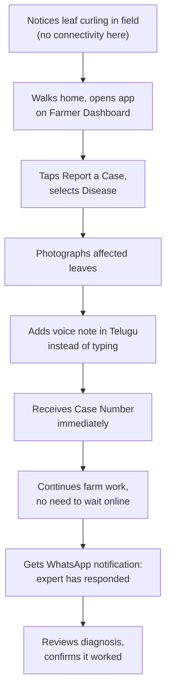
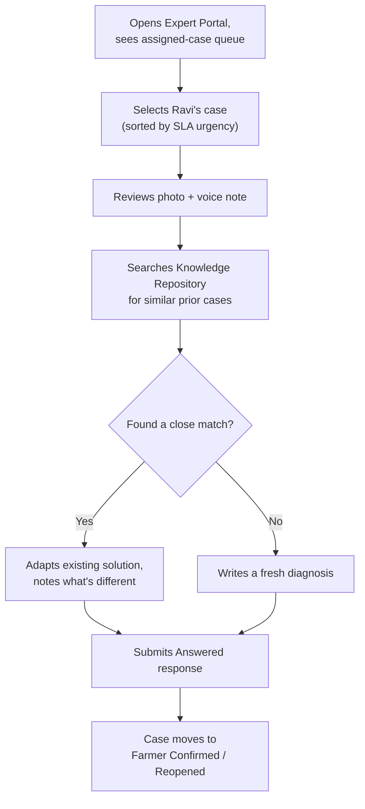

# 05 — Target Users

**Document Type:** Product Strategy Document
**Document Owner:** Product Office
**Status:** Approved
**Version:** 1.0.0
**Classification:** Internal — Strategic Planning
**Series Position:** Document 6 of the Organic Carbon Farming documentation series

---

## Document Control

| Field | Value |
|---|---|
| Document ID | AGRI-PROD-005 |
| Document Name | Target Users |
| Version | 1.0.0 |
| Status | Approved |
| Author | Product Office |
| Reviewers | Project Sponsor / Product Owner (approved 2026-08-07) |
| Approval Authority | Project Sponsor / Product Owner |
| Parent Documents | [`000-Project-Charter.md`](../000-Project-Charter.md) (Approved, v1.0.0), [`01-Product/01-Vision.md`](01-Vision.md) (Approved, v1.0.0) |
| Related Documents | `01-Product/06-Competitive-Analysis.md`, `03-Requirements/User-Stories.md` (not yet written) |

### Revision History

| Version | Date | Author | Description |
|---|---|---|---|
| 1.0.0 | 2026-08-06 | Product Office | Initial Target Users document, expanding Charter Section 8's persona table into full journeys, device/connectivity/literacy profiles, and language needs, as promised in the Charter itself |
| 1.0.0 | 2026-08-07 | Project Sponsor / Product Owner | Reviewed and approved without changes |

---

## 1. Introduction

Charter Section 8 named seven personas in a single summary table and explicitly deferred the detail: *"Precise, detailed personas... will be developed in `01-Product/05-Target-Users.md`."* This is that document.

A persona table is easy to write and easy to ignore. This document is written to be used, not filed — every persona below carries a concrete journey, a real device/connectivity profile, and an explicit literacy and language assumption, because Product Philosophy #3 (Charter Section 16) is a specific, falsifiable design bar: *"If a feature only works well for a smartphone-fluent, literate, urban user, it has failed its primary persona."* This document is what makes that bar checkable against something concrete instead of an abstraction.

---

## 2. Scope

**In scope:**
- Full persona profiles for all seven roles named in Charter Section 8, plus a second Farmer archetype to capture real variation within the platform's most important persona
- Journey maps for the two highest-stakes flows: a farmer reporting a Case, and an expert working one
- A consolidated device/connectivity/literacy/language matrix
- Persona-driven functional and non-functional requirements

**Out of scope:**
- Competitive positioning → `01-Product/06-Competitive-Analysis.md`
- Detailed, testable user stories per persona → `03-Requirements/User-Stories.md`
- UI mockups and visual design → later Web/Mobile architecture documents

---

## 3. Objectives

After reading this document, a reader should be able to:

1. Describe each of the platform's user types with enough specificity to make a real design decision, not just recite a role name
2. Explain why two Farmer archetypes exist rather than one "average farmer," and what each implies for design
3. Walk through the Case-reporting and Case-working journeys and identify where each persona's constraints (device, literacy, language) actually bind

---

## 4. Definitions

| Term | Definition |
|---|---|
| **Persona** | A composite, research-informed archetype representing a real cluster of users — not a single individual, but specific enough to design against. |
| **Primary Persona** | A persona whose needs take precedence when in conflict with another persona's — the Farmer personas, per Mission Principle MP1. |
| **Journey Map** | A step-by-step trace of a persona moving through a core flow, annotated with device, connectivity, and emotional friction at each step. |
| **Functional Literacy** | The ability to read and act on interface text unaided — distinct from formal education level, and the specific bar Constraint C2 (Charter) is written against. |

---

## 5. Persona Summary

| Persona | Role Type | Primary Goal | Device | Literacy | Primary Language |
|---|---|---|---|---|---|
| Ravi Kumar | Farmer (primary archetype) | Report and resolve crop problems, learn, buy inputs | Budget Android smartphone (~₹8–12k) | Low-moderate; prefers voice/photo over reading/typing | Telugu |
| Lakshmi Devi | Farmer (secondary archetype) | Same, but time-constrained and higher functional literacy | Shared family Android smartphone | Moderate-high; comfortable with short text | Telugu |
| Dr. Suresh Reddy | Agricultural Expert | Resolve assigned Cases efficiently, build authored content | Laptop/tablet, Expert Portal | High | Telugu + English |
| Priya Nair | Moderator | Approve content, assign experts, keep the Knowledge Repository clean | Desktop, Moderator console | High | Telugu + English |
| Operations Lead | Platform Administrator | Run the business day to day — users, experts, vendors, payments, reports | Desktop, Admin console | High | English (internal ops tooling) |
| Regional Distributor | Vendor / Supplier | List products, manage inventory, fulfill orders | Desktop or tablet | Moderate-high | Telugu + English |
| Support Agent | Support Agent | Resolve account/payment/order issues quickly, without touching agronomic cases | Desktop, Admin-adjacent tooling | High | Telugu + English |
| Prospective Farmer | Guest | Evaluate the platform before committing to register | Any smartphone, often lower-end | Variable | Telugu |

---

## 6. Detailed Personas

### 6.1 Ravi Kumar — Farmer, Primary Archetype

- **Profile:** 34, smallholder, 2 acres of chilli in rural Andhra Pradesh. Completed schooling to 8th standard; reads Telugu slowly, avoids typing when he can.
- **Goals:** Get a fast, trustworthy answer when something goes wrong with his crop; avoid depending on the input dealer's advice, which he suspects is sales-driven.
- **Frustrations today:** WhatsApp groups give conflicting answers; the nearest extension officer visits rarely and unpredictably; the input dealer is the only consistently available source, and Ravi doesn't fully trust it.
- **Device & connectivity:** Budget Android phone, intermittent 4G that degrades to 2G/3G in parts of his field.
- **Literacy & language:** Telugu only; low confidence typing more than a few words; comfortable with voice notes and photos.
- **What this implies for design:** Case submission must be completable with almost no typing — category selection, photo, and a voice note should be sufficient on their own, per Mission FR-M5.

### 6.2 Lakshmi Devi — Farmer, Secondary Archetype

- **Profile:** 42, manages a 3-acre mixed vegetable farm largely alone while her husband works construction in a nearby town. Completed schooling to 10th standard.
- **Goals:** Same as Ravi's, but time is the binding constraint, not literacy — she needs to get in, report the problem, and get back to the field or the house.
- **Frustrations today:** No time to wait on hold or travel to an extension office; values anything that respects her time.
- **Device & connectivity:** Shares a smartphone with her teenage son, mostly available to her in the evening.
- **Literacy & language:** Telugu, moderate-high functional literacy — can type short messages but prefers not to when voice is faster.
- **What this implies for design:** Speed matters as much as simplicity for this persona — a flow that's accessible but slow (e.g., many confirmation screens) fails her just as much as one that assumes too much literacy fails Ravi. **Both farmer archetypes converge on the same design conclusion by different routes: voice and photo first, minimal steps.**

### 6.3 Dr. Suresh Reddy — Agricultural Expert

- **Profile:** 45, agronomist, 15 years in government extension services, contracted part-time to the platform.
- **Goals:** Resolve assigned Cases well and efficiently; build a body of authored Knowledge Articles that reflects his expertise; avoid a chaotic, unstructured inbox.
- **Frustrations today (with informal channels):** Fielding the same repeated questions with no way to point people to a prior answer; no record of what he's already told a given farmer.
- **Device & connectivity:** Works from a laptop or tablet during defined hours, reliable connectivity.
- **Literacy & language:** Fully literate in Telugu and English; comfortable with structured software tools.
- **What this implies for design:** The Expert Portal is the one place in the platform where information density is a feature, not a risk — search over prior cases, structured intake, and workload visibility (Mission FR-M1) all matter more here than simplicity.

### 6.4 Priya Nair — Moderator

- **Profile:** In-house content and case-quality lead, distinct from Administration.
- **Goals:** Keep the Knowledge Repository free of duplicates and low-quality content; keep the case-assignment queue moving; catch Guardrail violations (Business Goals Section 6) before they become patterns.
- **Device & connectivity:** Desktop, Moderator console, reliable office connectivity.
- **Literacy & language:** Fully literate, bilingual.
- **What this implies for design:** Needs a genuinely efficient review queue with bulk actions — a Moderator facing a slow, one-at-a-time approval UI will become the platform's actual bottleneck for Knowledge Article publication (Charter Module 3 note).

### 6.5 Operations Lead — Platform Administrator

- **Profile:** Runs day-to-day platform operations — user, expert, vendor, and payment management, plus reporting.
- **Goals:** Visibility into SLA breaches, expert capacity, revenue by stream (per Business Goals BR-B2), and audit trails without needing to query a database directly.
- **What this implies for design:** Administration needs the same dashboard-first philosophy as the Farmer Dashboard (Charter Module 2 note) — a menu of raw CRUD screens fails this persona the same way a text-only flow fails Ravi.

### 6.6 Regional Distributor — Vendor / Supplier

- **Profile:** A small-to-mid agricultural input distributor, onboarded by the platform operator (Charter Assumption A4 — no self-serve vendor portal in Phase 1).
- **Goals:** Get visibility into sales and inventory without needing to be a power user of a complex admin system.
- **What this implies for design:** Since onboarding is admin-mediated in Phase 1, the vendor's own interface can be intentionally minimal — this is a deliberate, charter-level scope reduction, not an oversight.

### 6.7 Support Agent

- **Profile:** Handles account, payment, and order issues that are explicitly not agronomic Case Management.
- **Goals:** Resolve tickets quickly with visibility into member/order/payment status, without needing (or having) access to agronomic Case content.
- **What this implies for design:** Role-based access control needs to draw this boundary precisely — a Support Agent who can see Case Management content by accident is both a scope violation and a Charter C5/security concern.

### 6.8 Prospective Farmer — Guest

- **Profile:** Someone evaluating the platform before registering — has heard about it from a neighbor, a success story, or a promotional video.
- **Goals:** Decide, quickly and without commitment, whether this is worth registering for.
- **What this implies for design:** The public preview surface (success stories, promotional content) has to earn trust *before* the trust flywheel (`01-Vision.md`, Section 6) has any chance to run for this specific person — this is the literal entry point Vision Risk RV1 (Cold Start) is about.

---

## 7. Journey Maps

### 7.1 Ravi Reports a Case

**Friction points this journey is designed against:** step A (no connectivity in-field) is why the flow doesn't require Ravi to act immediately — Draft persistence (Mission NFR, Charter Constraint C3) lets him complete the report once he's back in range. Step E is the single most important design decision in this journey: if voice weren't a first-class option, Ravi's literacy profile would make this journey meaningfully harder, not just less convenient.

### 7.2 Dr. Reddy Works a Case

**Why step D matters:** this is the Knowledge Deflection mechanism (Business Goals Section 7) operating at the expert's desk, not just the farmer's — an expert who can quickly find and adapt a prior answer resolves cases faster (Mission Principle MP2) without any drop in quality.

---

## 8. Device, Connectivity, Literacy & Language Matrix

| Persona | Device | Connectivity | Literacy Bar | Language(s) |
|---|---|---|---|---|
| Ravi (Farmer) | Budget Android | Intermittent 2G/3G/4G | Low-moderate; voice/photo first | Telugu only |
| Lakshmi (Farmer) | Shared Android | Moderate, evening-concentrated | Moderate-high; time-constrained | Telugu only |
| Expert | Laptop/tablet | Reliable | High | Telugu + English |
| Moderator | Desktop | Reliable | High | Telugu + English |
| Administrator | Desktop | Reliable | High | English |
| Vendor | Desktop/tablet | Reliable | Moderate-high | Telugu + English |
| Support Agent | Desktop | Reliable | High | Telugu + English |
| Guest | Any smartphone | Variable, often lower-end | Variable | Telugu |

Per Charter Assumption A9, Phase 1 launches with a **single primary operating language**. Given the persona profiles above, **Telugu** is the recommended launch language for all farmer-facing surfaces, with English retained for internal/admin-side tooling where every persona is already bilingual. Multi-language expansion is an early, but explicitly not day-one, requirement.

---

## 9. Business Rules

| ID | Rule | Rationale |
|---|---|---|
| BR-T1 | Any farmer-facing flow proposed in `03-Requirements/` must be checked against both Ravi's and Lakshmi's journeys before approval, not just one. | Prevents "the average farmer" from becoming a design fiction that fits neither real archetype. |
| BR-T2 | Role-based access control for Support Agent must be reviewed whenever Case Management's data model changes, to ensure the agronomic-content boundary (Section 6.7) still holds. | Direct consequence of Charter Constraint C5. |
| BR-T3 | Persona assumptions in this document are hypotheses until validated by real usability research with the Stage 2 Pilot Cohort (`01-Product/04-Product-Roadmap.md`, Section 7) — the Pilot Gate is also this document's validation checkpoint. | Ties directly to Vision Assumptions AV1/AV2. |

---

## 10. Functional Requirements

| ID | Requirement |
|---|---|
| FR-T1 | The platform SHALL support full Case submission (category, evidence, description) via photo and voice input with no required typed field in the golden path, per Ravi's journey (Section 7.1). |
| FR-T2 | The platform SHALL notify farmers of Case status changes via a channel usable without opening the app (WhatsApp/SMS), not only in-app notifications. |
| FR-T3 | The Expert Portal SHALL surface a searchable view of prior, similar Cases directly from the case-working screen, not as a separate navigation step, per Dr. Reddy's journey (Section 7.2). |
| FR-T4 | Role-based access control SHALL prevent a Support Agent account from viewing Case Management content under any configuration. |

---

## 11. Non-Functional Requirements

| ID | Quality Attribute | Requirement |
|---|---|---|
| NFR-T1 | Language Coverage | All farmer-facing Phase 1 surfaces must be fully usable in Telugu at launch. |
| NFR-T2 | Low-Bandwidth Resilience | Ravi's journey (Section 7.1) must remain completable on a degraded 2G/3G connection, consistent with Charter Constraint C3. |
| NFR-T3 | Accessibility Baseline | Every core farmer flow must pass a usability test with a participant matching each farmer archetype before that flow ships, not only at initial launch. |

---

## 12. Assumptions

| # | Assumption | Impact if Invalid |
|---|---|---|
| AT1 | Telugu is the correct single launch language for the target initial geography. | If false, NFR-T1's language investment targets the wrong audience — this should be confirmed against actual target-region data before Stage 1 build-out, not assumed from these personas alone. |
| AT2 | Ravi and Lakshmi's archetypes cover the meaningful range of farmer literacy/time-constraint variation for Phase 1's target region. | If false, real Pilot Cohort research (BR-T3) may surface a third archetype this document doesn't yet account for — expected and fine, this document is a hypothesis set, not a closed list. |

---

## 13. Constraints

| # | Constraint | Source |
|---|---|---|
| CT1 | Persona work may not be used to justify scope outside the Charter's Phase 1 module boundary. | Charter Section 10.2 |
| CT2 | Farmer persona design decisions defer to Mission Principle MP1 (Serve the Farmer First) whenever they conflict with another persona's convenience. | `02-Mission.md`, Section 7 |

---

## 14. Risks

| # | Risk | Likelihood | Impact | Mitigation |
|---|---|---|---|---|
| RT1 | **Personas Treated as Settled Fact** — teams design against Ravi/Lakshmi as if validated, when they are, honestly, informed hypotheses pending Pilot Gate evidence. | Medium | Medium | BR-T3 explicitly frames these as hypotheses; Pilot Cohort usability testing (Product Roadmap Section 7) is the real validation step. |
| RT2 | **Language Investment Misdirected** — AT1 turns out wrong for the actual initial launch geography chosen later. | Low-Medium | High | Confirm target launch geography explicitly before Stage 1 (Product Roadmap) locks engineering effort into Telugu-specific work. |
| RT3 | **Internal Tooling Personas Under-Designed** — because Experts/Moderators/Admins are all "high literacy," their UX gets deprioritized relative to farmer-facing polish, quietly violating Mission Principle MP2. | Medium | Medium | Mission's own Operating Cadence (Weekly Expert Capacity Review) is one built-in check against this; Expert Portal usability should get the same rigor as farmer flows, not less. |

---

## 15. Future Enhancements

- **Additional farmer archetypes:** as Pilot Cohort data comes in (Product Roadmap Section 7), expect to add or revise archetypes rather than treat Ravi/Lakshmi as final.
- **Multi-language expansion sequencing:** once Telugu-first Phase 1 is stable, this document should be revisited to sequence the next languages by actual registered-farmer geography, not guesswork.
- **Vendor self-service persona:** if Charter Assumption A4 changes (self-serve vendor portal becomes in scope), the Vendor persona (Section 6.6) needs substantially more depth than given here.

---

## 16. References

- [`000-Project-Charter.md`](../000-Project-Charter.md) — Approved v1.0.0; source of the original persona table (Section 8) and Assumption A9 (single launch language)
- [`01-Product/01-Vision.md`](01-Vision.md) — Approved v1.0.0; source of the Ravi "Day in the Life" narrative this document's journey map (Section 7.1) elaborates
- [`01-Product/02-Mission.md`](02-Mission.md) — Approved v1.0.0; source of Mission Principle MP1, this document's tie-breaking rule
- [`01-Product/03-Business-Goals.md`](03-Business-Goals.md) — Approved v1.0.0; source of the Knowledge Deflection mechanism referenced in Section 7.2
- [`01-Product/04-Product-Roadmap.md`](04-Product-Roadmap.md) — Approved v1.0.0; source of the Pilot Cohort this document's persona hypotheses will be validated against
- `01-Product/06-Competitive-Analysis.md` — pending
- `03-Requirements/User-Stories.md` — pending; will convert these personas into testable user stories

---

## Approval

| Approver | Role | Decision | Date |
|---|---|---|---|
| Session Owner | Project Sponsor / Executive Owner | Approved | 2026-08-07 |
| Session Owner | Product Owner | Approved | 2026-08-07 |

---

*End of Document 05-Target-Users, v1.0.0 — Approved. Next: `01-Product/06-Competitive-Analysis.md`.*
