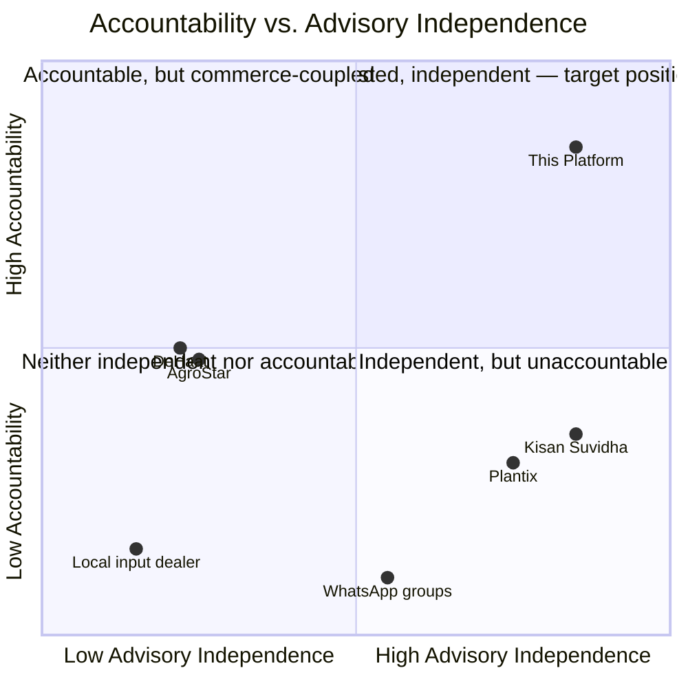

# 06 — Competitive Analysis

**Document Type:** Product Strategy Document
**Document Owner:** Product Office
**Status:** Draft — Pending Approval
**Version:** 1.0.0
**Classification:** Internal — Strategic Planning
**Series Position:** Document 7 of the Digital Agriculture Knowledge & Advisory Platform documentation series

---

## Document Control

| Field | Value |
|---|---|
| Document ID | AGRI-PROD-006 |
| Document Name | Competitive Analysis |
| Version | 1.0.0 |
| Status | Draft |
| Author | Product Office |
| Reviewers | Pending assignment |
| Approval Authority | Project Sponsor / Product Owner |
| Parent Documents | [`000-Project-Charter.md`](../000-Project-Charter.md) (Approved, v1.0.0), [`01-Product/01-Vision.md`](01-Vision.md) (Approved, v1.0.0) |
| Related Documents | `01-Product/07-Success-Metrics.md` (not yet written) |

### Revision History

| Version | Date | Author | Description |
|---|---|---|---|
| 1.0.0 | 2026-08-07 | Product Office | Initial Competitive Analysis, grounded in current market research (see References) rather than assumption, positioning the platform on Accountability and Advisory Independence against four real categories of alternative |

---

## 1. Introduction

Every persona in `01-Product/05-Target-Users.md` already has an alternative today — that's the whole premise of the Vision document's "Day in the Life" narrative. This document names those alternatives specifically, states what each one is genuinely good at, and is honest about where each one is a real threat to this platform's thesis, not just a weaker also-ran.

The temptation in a competitive analysis is to flatter the subject. This one is written against that temptation deliberately: [Section 8](#8-honest-vulnerabilities) exists specifically to state where competitors are currently *better* than what this platform's Vision claims, because a Sponsor making investment decisions on a document that only lists our advantages is being set up to be surprised later.

---

## 2. Scope

**In scope:**
- Four real categories of alternative a target farmer has today: government platforms, AI-diagnosis apps, full-stack input-distribution platforms, and informal channels
- Positioning on two axes that map directly to Vision Pillars P1 (Trust Through Accountability) and P4 (Commerce Serves Advice, Never Steers It)
- Explicit, honest statement of where competitors currently win

**Out of scope:**
- Pricing/feature-parity comparison tables at the individual-SKU level → belongs in ongoing competitive intelligence, not a one-time document
- Legal/IP analysis of any competitor → not performed, not implied

---

## 3. Objectives

After reading this document, a reader should be able to:

1. Name the four categories of real alternative a target farmer has today, and one concrete example of each
2. Explain the platform's positioning on the Accountability × Advisory Independence quadrant, and why that specific pairing was chosen over more obvious axes like price or feature count
3. State at least one area where a named competitor is currently and genuinely better than what this platform offers

---

## 4. Definitions

| Term | Definition |
|---|---|
| **Advisory Independence (axis)** | The degree to which a platform's advice is structurally free of a commercial incentive to sell inputs — high independence means advisory and commerce are organizationally separate (Vision Pillar P4); low independence means the same entity profits from both the diagnosis and the product sold to treat it. |
| **Accountability (axis)** | The degree to which an answer is traceable to a specific, credentialed, responsible party — high accountability means a named human expert stands behind the answer (Vision Pillar P1); low accountability means the answer comes from an anonymous community, an unattributed AI model, or a generic broadcast. |

---

## 5. Competitive Landscape Overview

| Category | Example | Advisory Independence | Accountability | Core Business Model |
|---|---|---|---|---|
| Government platform | Kisan Suvidha / Kisan Call Centre | High (no commerce) | Low-medium (broadcast advisory, call-center staff not case-owning) | Free, publicly funded |
| AI-diagnosis app | Plantix | High (freemium/API model, not input sales) | Low (AI-first; community answers are uncredentialed) | Freemium app + B2B data/API licensing |
| Full-stack input platform | DeHaat | Low (advisory is part of an input/credit/market-linkage bundle) | Medium (some human agronomist involvement, but incentive-coupled) | Input distribution, credit, market linkage |
| Marketplace + advisory | AgroStar | Low (same structural coupling as DeHaat) | Medium | Agri-input marketplace with advisory as a retention layer |
| Informal channels | WhatsApp groups, local dealers | Low (dealer advice) / N/A (WhatsApp groups) | Very low (anonymous or self-interested) | N/A / dealer margin |
| **This Platform** | — | **High** (Advisory Independence, Vision P4) | **High** (named, credentialed expert, Vision P1) | Membership + secondary marketplace, capped mix (Business Goals BG3) |

---

## 6. Positioning

No existing player occupies the high-independence, high-accountability quadrant simultaneously. DeHaat and AgroStar earn accountability points for having real agronomists, but structurally can't earn full independence points while advisory sits inside an input-distribution business model. Plantix and Kisan Suvidha earn independence points (neither profits from input sales) but lose accountability points — Plantix by design (AI-first, anonymous community), Kisan Suvidha by model (broadcast advisory, not a personally-owned Case).

This is the platform's actual competitive thesis: **not** "better AI than Plantix" and **not** "a better marketplace than AgroStar/DeHaat," but the specific, currently-unoccupied combination of both axes at once.

---

## 7. Detailed Competitor Notes

- **DeHaat** — end-to-end platform (inputs, credit, insurance, market linkage) with large field teams, strong in tier-2/tier-3 reach. Genuine strength: full-stack farmer relationship, financing access this platform doesn't offer in Phase 1. Genuine weakness relative to this platform: advisory is structurally a retention/upsell layer for the input and credit business, not an independently governed function.
- **AgroStar** — India's largest digital farmer network by claimed reach (5M+ farmers), recently well-capitalized ($30M raise, November 2025) with a stated pivot toward climate-resilient agriculture. Genuine strength: scale and brand recognition already exist; this platform has neither at launch. Genuine weakness relative to this platform: same commerce-advisory coupling as DeHaat.
- **Plantix** — AI-powered image diagnosis with a claimed accuracy rate "exceeding 90%," against a cited human-expert baseline of 60–70% in the same source. Also offers a farmer community (500+ contributing experts), disease outbreak alerts, and a fertilizer calculator. Genuine strength: **this accuracy claim is a real, direct challenge to Vision Pillar P1's premise** that a human-in-the-loop answer is inherently more trustworthy than an automated one — addressed honestly in [Section 8](#8-honest-vulnerabilities), not dismissed. Genuine weakness relative to this platform: no single named party is accountable for a given answer, and there is no structured, auditable case lifecycle — a farmer gets a diagnosis, not a resolved, trackable Case.
- **Kisan Suvidha / Kisan Call Centre** — government-run, free, and structurally independent of any commercial interest, covering weather, mandi prices, plant protection, dealer contacts, and general agro-advisory. Genuine strength: free, broad reach, no trust-in-a-startup problem. Genuine weakness relative to this platform: generic, broadcast-style advisory rather than a personally-owned, evidence-based Case with a named expert and a resolution the farmer explicitly confirms.
- **Informal channels (WhatsApp groups, local dealers)** — the actual default today for most of the target persona base (per `01-Product/05-Target-Users.md`), not a hypothetical competitor. Zero accountability, but zero friction and already-trusted social relationships — the bar this platform has to clear isn't "better than a formal competitor," it's "better than a phone call to a cousin," which is a genuinely harder bar in some respects.

---

## 8. Honest Vulnerabilities

| Vulnerability | Why It's Real | Our Response (not a dismissal) |
|---|---|---|
| **Plantix's cited accuracy claim** — AI diagnosis reportedly outperforms average human accuracy on image-based identification. | If true even approximately, it directly undercuts the assumption that human experts are more *correct*, not just more *accountable*. | Vision Pillar P1 was deliberately built around accountability, not raw accuracy — a wrong AI diagnosis has no one to appeal to or hold responsible; a wrong human diagnosis does, and the Reopened Case state (`01-Vision.md` supersedes the earlier simpler lifecycle — see Charter Section 20) exists specifically for this. This platform should not claim to out-diagnose Plantix; it should claim to out-*account-for-being-wrong* it. |
| **DeHaat/AgroStar's existing scale and field presence.** | Trust and distribution built over years cannot be replicated by a better Vision statement alone. | Vision Assumption AV1/AV2 already flag this as unproven — the Pilot Gate (`01-Product/04-Product-Roadmap.md`, Section 7) exists precisely because scale claims mean nothing until real farmers choose this platform over an established one. |
| **Kisan Suvidha's free, zero-risk price point.** | A paid membership model (Business Goals Section 8) competes against a free government alternative for the same basic information categories (weather, mandi prices). | Differentiation has to be on the personally-owned Case and Knowledge Repository experience, not on categories Kisan Suvidha already covers for free — Requirements work should avoid duplicating generic broadcast content Kisan Suvidha already provides well. |
| **Informal channels' zero friction.** | A cousin's phone call has no registration, no app download, no membership fee. | This is exactly what the Vision document's Cold Start risk (RV1) is about — the platform has to earn the switch, not assume it. |

---

## 9. Business Rules

| ID | Rule | Rationale |
|---|---|---|
| BR-C1 | Marketing and requirements work may not position this platform as "more accurate than AI" without evidence — the differentiation claim is accountability, per Section 8, not diagnostic accuracy. | Prevents an unsubstantiated claim that a competitor could publicly and correctly refute. |
| BR-C2 | Any feature proposal justified primarily by "matching a competitor's feature" must also pass the Vision Alignment Checklist (`01-Vision.md`, Section 8.1) — competitive parity alone is not sufficient justification. | Prevents feature-matching from quietly eroding Advisory Independence (e.g., adding input-sales-linked recommendations because DeHaat has them). |

---

## 10. Functional Requirements

| ID | Requirement |
|---|---|
| FR-C1 | The platform SHALL display the responding expert's name and credential status on every Case resolution, as the primary differentiator against AI-diagnosis and anonymous-community alternatives (Section 8). |
| FR-C2 | The platform SHALL make the Case Lifecycle status (Charter Glossary) visible to the farmer at every stage, differentiating a "resolved, tracked Case" from Kisan Suvidha's and WhatsApp's un-tracked, one-shot advisory. |

---

## 11. Non-Functional Requirements

| ID | Quality Attribute | Requirement |
|---|---|---|
| NFR-C1 | Response Competitiveness | Median time-to-first-expert-response (Charter Success Criteria, Section 6) must remain fast enough to compete credibly against Plantix's near-instant AI diagnosis, even though the mechanism is different — a multi-day wait would lose against any alternative regardless of trust positioning. |

---

## 12. Assumptions

| # | Assumption | Impact if Invalid |
|---|---|---|
| AC1 | Plantix's cited 90%+ AI accuracy figure and 60–70% human baseline (Section 7) are approximately representative, even though sourced from Plantix's own materials rather than independent verification. | If the gap is smaller or reversed in practice, Section 8's framing should shift from "we're accountable despite being less accurate" to a more confident accuracy claim — worth re-verifying with independent data before final Requirements work. |
| AC2 | Target farmers value accountability enough to choose a paid, human-expert platform over a free, high-accuracy AI alternative. | This is the platform's central bet and is explicitly untested — the Pilot Gate is where it gets real evidence, not this document. |

---

## 13. Constraints

| # | Constraint | Source |
|---|---|---|
| CC1 | Competitive positioning may not be used to justify AI features in Phase 1 — Section 8's "accountability, not accuracy" framing is a Phase 1 positioning choice, not a permanent renunciation of AI (Charter Section 18.2, Phase 2). | Charter Constraint C1 |

---

## 14. Risks

| # | Risk | Likelihood | Impact | Mitigation |
|---|---|---|---|---|
| RC1 | **Accuracy Gap Undermines Trust Positioning** — if Plantix's accuracy claim holds and farmers experience visibly worse diagnostic quality from human experts, "accountability" alone may not be a sufficient differentiator. | Medium | High | Track diagnostic quality (via Farmer Confirmed vs. Reopened rate, `01-Vision.md` Success Criteria) from the Pilot Gate onward — this is measurable, not just asserted. |
| RC2 | **Incumbent Adds a Human Layer** — DeHaat or AgroStar could add a "named expert" feature on top of their existing scale, closing the accountability gap without needing to solve the harder Advisory Independence problem. | Medium | Medium | This platform's real moat is Advisory Independence (organizationally separate from commerce), which is structurally harder for an input-distribution business to retrofit than a UI feature — Business Goals Guardrails (G1/G2) exist specifically to keep this true over time, not just at launch. |
| RC3 | **Free Government Alternative Improves** — Kisan Suvidha or a successor Digital Agriculture Mission initiative adds more personalized, tracked advisory. | Low-Medium | Medium | Government platforms move slowly and are structurally broadcast-oriented; monitor but do not over-weight this risk in near-term planning. |

---

## 15. Future Enhancements

- **Ongoing competitive intelligence:** this document is a point-in-time snapshot (August 2026); it should be revisited at each Phase Gate (Charter Section 18.3), not treated as permanently accurate.
- **Independent accuracy benchmarking:** Assumption AC1 should be replaced with actual comparative data once the platform has enough resolved Cases to measure diagnostic quality directly, rather than relying on a competitor's own published figures.

---

## 16. References

- [`000-Project-Charter.md`](../000-Project-Charter.md) — Approved v1.0.0
- [`01-Product/01-Vision.md`](01-Vision.md) — Approved v1.0.0; source of Vision Pillars P1/P4 used as this document's positioning axes
- [`01-Product/04-Product-Roadmap.md`](04-Product-Roadmap.md) — Approved v1.0.0; source of the Pilot Gate referenced as the real test of Assumption AC2
- [`01-Product/05-Target-Users.md`](05-Target-Users.md) — Approved v1.0.0; source of the informal-channel default described in Section 7
- [17 Top AgriTech Startups in India in 2026 — Decentro](https://decentro.tech/blog/agritech-startups/)
- [Agrostar — 2026 Company Profile, Funding & Competitors — Tracxn](https://tracxn.com/d/companies/agrostar/__4kDcYTz9YIBd_sG4aaLsaJjUumzsubAn6BsXs1AKJzo)
- [Prosus Ventures leads $30M investment in DeHaat — TechCrunch](https://techcrunch.com/2021/01/18/prosus-ventures-leads-30-million-investment-in-indian-agritech-startup-dehaat)
- [Plantix: AI-Powered Crop Diagnosis — Agtecher](https://agtecher.com/en/software/plantix/)
- [Detecting and managing crop pests and diseases with AI: Insights from Plantix — GSMA](https://www.gsma.com/solutions-and-impact/connectivity-for-good/mobile-for-development/programme/agritech/detecting-and-managing-crop-pests-and-diseases-with-ai-insights-from-plantix/)
- [Plantix — your crop doctor — Google Play](https://play.google.com/store/apps/details?id=com.peat.GartenBank&hl=en_US)
- [Kisan Suvidha App, A Digital Support System for Farmers — Oliveboard](https://www.oliveboard.in/blog/kisan-suvidha-app/)
- [Kisan Suvidha App for Farmers' Agricultural Needs in India — IndiaFilings](https://www.indiafilings.com/learn/kisan-suvidha-app)

---

## Approval

| Approver | Role | Decision | Date |
|---|---|---|---|
| _Pending_ | Project Sponsor / Executive Owner | | |
| _Pending_ | Product Owner | | |

---

*End of Document 06-Competitive-Analysis. Per project governance rules, the next document in the series (`01-Product/07-Success-Metrics.md`) will not be generated until this document is reviewed and explicitly approved.*
