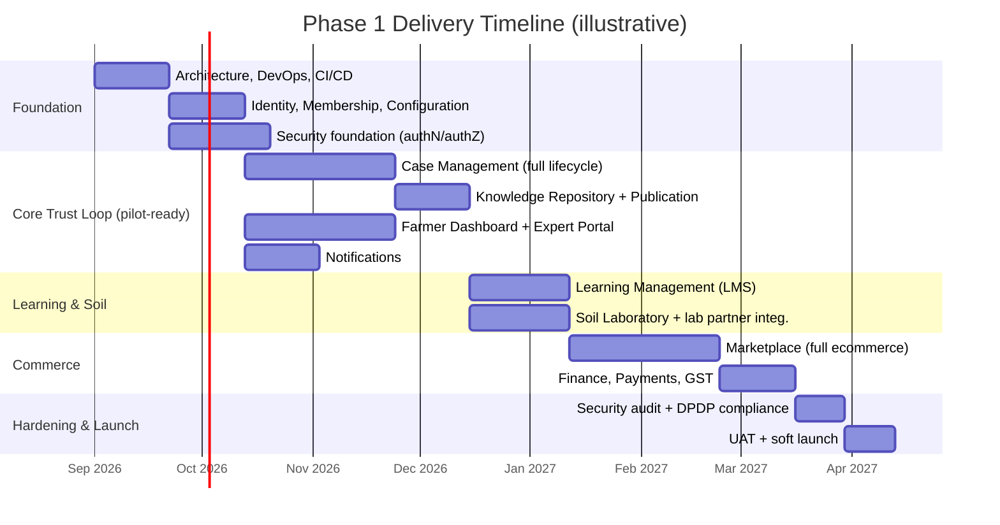

# Appendix — Phase 1 Timeline, Technology Stack & Security Reference

**Document Type:** Supplementary Reference Material
**Status:** Working reference — informal, not part of the governed document series
**Related To:** [`000-Project-Charter.md`](../000-Project-Charter.md) (Approved, v1.0.0), [`01-Product/01-Vision.md`](../01-Product/01-Vision.md) (Approved, v1.0.0), [`01-Product/02-Mission.md`](../01-Product/02-Mission.md) (Draft)
**Note:** This document captures architect-level input on delivery timeline, technology choices, and security approach. It is a reference, not a numbered, approval-gated document in the series — if any part of it should become binding, it belongs in `01-Product/04-Product-Roadmap.md`, `04-Architecture/`, and `11-Security/` respectively, each produced and approved in its proper turn.

---

## 1. Timeline

Given Charter Risk R11 (Phase 1 bundles four near-independent product surfaces — Case Management, LMS, e-commerce, and lab-sample tracking), a staged delivery is recommended over building everything in parallel from day one. Illustrative estimate: **~9–10 months to Phase 1 GA**, assuming a reasonably staffed team — exact pace depends on headcount, which the Charter (Assumption A1, Constraint C10) treats as external to this document.

**Key milestones:**

| Milestone | Approx. Elapsed Time | Significance |
|---|---|---|
| Core Trust Loop pilot-ready | ~4 months | Case Management + Knowledge Repository + Farmer Dashboard usable by real farmers — earliest point to validate Vision Assumptions AV1/AV2 (do farmers trust it, does knowledge generalize) before the more expensive Marketplace build begins. |
| Full Phase 1 GA | ~9–10 months | All 14 Charter modules complete, security-audited, DPDP-reviewed, and ready for public launch. |

---

## 2. Technology Stack

| Layer | Recommendation | Why |
|---|---|---|
| **Backend** | NestJS (Node.js/TypeScript) | Modular, DI-based structure maps directly onto the Charter's Modular Architecture + DDD principles; first-class support for CQRS (needed for the Dashboard read model) and event-driven patterns. |
| **Database** | PostgreSQL, primary OLTP | Relational integrity for Case/Farm-Land/Order data; JSONB for flexible fields (Knowledge Article tags, feedback); mature, cloud-portable. |
| **ORM** | Prisma | Type-safe schema, strong migration story for a fast-moving Phase 1 schema. |
| **Dashboard read model** | Materialized views / a dedicated read-replica, refreshed on domain events | Implements the CQRS note already added to the Charter (Module 2) — avoids the dashboard fanning out to 6+ live services under low-bandwidth conditions. |
| **Search** | PostgreSQL full-text search + structured filters (Module 14 taxonomy) | Matches the Charter's "non-AI, index/category-based search" constraint exactly — no need for Elasticsearch/OpenSearch in Phase 1; vector search is explicitly a Phase 2 concern. |
| **Cache / Queue** | Redis + BullMQ | Async jobs: notifications, media processing, Knowledge Article publication events, SLA-breach checks. |
| **Object storage** | S3-compatible (AWS S3, Cloudflare R2, or self-hosted MinIO) | Backs the centralized Media Library (Module 8) with signed URLs, not public buckets. |
| **Farmer app** | Progressive Web App first, Capacitor-wrapped native later if needed | Matches Charter Constraints C2/C3 (low-bandwidth, low-literacy) — one codebase, installable, service-worker offline caching for Draft case persistence. |
| **Admin / Expert Portal / Moderator console** | React + TypeScript SPA | Desktop/tablet-first, matching the personas in Charter Section 8. |
| **Notifications** | WhatsApp Business API, SMS gateway (e.g. MSG91/Twilio), Firebase Cloud Messaging, transactional email | Covers all five channels in Charter Module 12. |
| **Payments** | Razorpay (or equivalent UPI-native gateway), hosted checkout / tokenization | Keeps card data out of platform-owned systems entirely, per Charter Constraint C4. |
| **DevOps** | Docker containers, GitHub Actions CI/CD, deploy to a managed cloud (or a VPS with Docker Compose if budget-constrained early) | Satisfies Cloud Native without over-committing to Kubernetes before Phase 1 traffic justifies it. |
| **Observability** | Structured logging (pino), Sentry for errors, uptime monitoring | Needed for the SLA-breach visibility that Mission Principle MP2 depends on. |

---

## 3. Security

| Area | Approach |
|---|---|
| **AuthN** | Mobile number + password, OTP via SMS for verification/recovery; JWT access token + refresh token rotation. |
| **AuthZ** | Role-based access control — Farmer, Expert, Moderator, Administrator, Vendor, Support — enforced at the API layer, not just hidden in the UI. Expert Portal access gated behind the Module 10 credential-verification step before a token can be issued. |
| **Data at rest / in transit** | Encryption at rest for the database and object storage; TLS 1.2+ everywhere; no plaintext PII in logs. |
| **DPDP Act 2023 compliance** | Explicit consent capture at registration; data minimization (collect only what each module needs); anonymize — not hard-delete — a farmer's identity in Closed cases/Knowledge Articles on an erasure request, satisfying erasure rights without breaking the Audit Trail principle or Knowledge Repository integrity. This needs a written policy in `11-Security/`, not an ad hoc resolution. |
| **Payment security** | PCI scope kept minimal via hosted checkout/tokenization — the platform itself never stores card data. |
| **API security** | Rate limiting, strict input validation, standard OWASP Top 10 mitigations (injection, XSS, CSRF, broken access control), WAF in front of the API gateway. |
| **Audit trail** | Append-only, tamper-evident log of every Case state transition, content publication, order transaction, and expert/moderator assignment — already a binding Charter principle (Audit Friendly), not optional. |
| **Media/content security** | File-type validation and malware scanning on every upload into the Media Library (photos, videos, voice notes); access via short-lived signed URLs, never public buckets. |
| **Secrets management** | Managed secrets store (e.g. AWS Secrets Manager, Doppler, or Vault) — never in source control or plain env files in production. |
| **Mobile/PWA-specific** | Encrypted local storage for Draft cases persisted client-side — not plaintext local storage. |
| **Incident response** | A written breach-notification procedure aligned with DPDP Act timelines, owned by the Security & Compliance function named in Charter Section 7. |

---

*This is working reference material. Formalize into `01-Product/04-Product-Roadmap.md`, `04-Architecture/`, and `11-Security/` when the series reaches those documents.*
